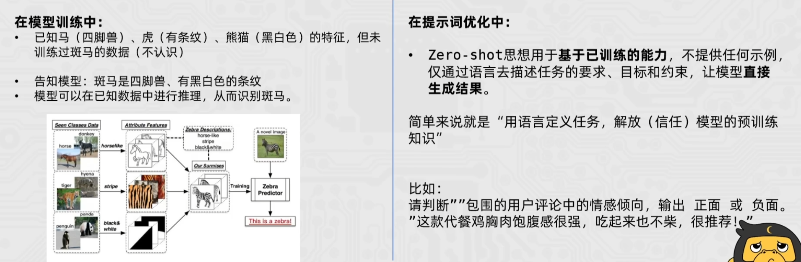
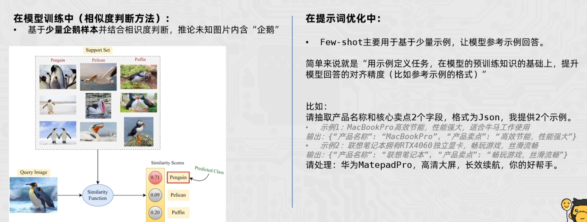
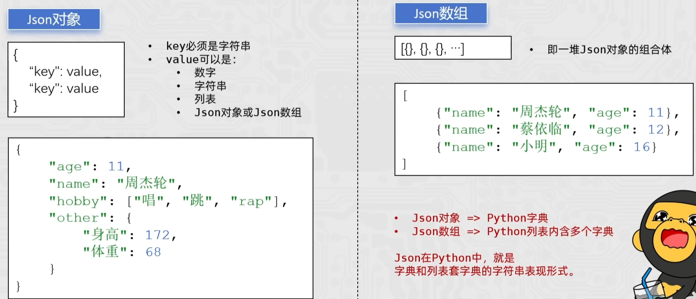

> 本文档为教程拆分章节，完整文档见 [LangChain-Tutorial.md](../LangChain-Tutorial.md)

## 四、提示词工程

提示工程（Prompt Engineering），也称为 In-Context Prompting，是指在**不更新模型权重**的情况下如何与大模型交互以引导其行为以获得所需结果的方法

- 提示工程 —— 提问的工程
- 在人工智能领域，Prompt 指的是用户给大型语言模型发出的指令
- 虽然看似简单，但实际上，Prompt 的设计对于模型的结果影响很大
- 因此如何设计 Prompt ，进而与模型更好的交互，是研究人员那必备的必不可少的技能（提示工程）

### 提示词技巧

任何 Prompt 技巧，都不如清晰的表达你的需求。类似人与人沟通，如果话说不明白，不可能让别人理解你的思想。因此，写出清晰的指令是核心

- 技巧 1：详细的描述
- 技巧 2：让模型充当某个角色
- 技巧 3：使用分隔符标明输入的不同部分，如用中括号、XML标签、三引号等分隔符可以帮助划分要区别对待的文本，也可以帮助模型更好的理解文本内容。常用''' '''把内容框起来
- 技巧 4：对任务指定步骤
- 技巧 5：提供例子
- 技巧 6：使用参考文本，基于文本文档辅助大模型回答，降低模型**幻觉**问题，是经典的知识库用法，让大模型使用我们提供的信息来组成答案

用更详细、更清晰、有逻辑、有参考的提问，获得期望中的回答效果。不管是 RAG 还是 Agent 智能体亦或是其他围绕模型的各类复杂的开发工作，本质上都可以简单总结为在提示词上下功夫

 提示词优化是所有大模型应用开发的基础必修课，一个好的提示词，甚至能让基础模型的输出效果媲美经过简单微调的模型

### 提示词优化思想

#### Zero-shot 思想

Zero-shot 学习（Zero-shot Learning）是指在训练阶段不存在与测试阶段完全相同的类别，但是模型可以使用训练过的知识来推广到测试集中的新类别上

这种能力被称为“零样本”学习，因为模型在训练时从未见过测试集中的新类别，在**模型训练**和**提示词优化**中均有体现



#### Few-shot 思想

Few-shot 学习（Few-shot Learning）是指少样本学习，当模型在学习了一定类别的大量数据后，对于新的类别，只需要少量的样本就能快速学习，对应的有 one-shot learning，单样本学习，也算样本少到为一的情况下的一种 few-shot learning



#### 实战运用 —— 文本分类任务

```python
from openai import OpenAI

client = OpenAI(
    base_url="https://dashscope.aliyuncs.com/compatible-mode/v1"
)

# 示例数据
examples_data = {
    '新闻报道': '今日，股市经历了一轮震荡，受到宏观经济数据和全球贸易紧张局势的影响。投资者密切关注美联储可能的政策调整，以适应市场的不确定性。',
    '财务报告': '本公司年度财务报告显示，去年公司实现了稳步增长的盈利，同时资产负债表呈现强劲的状况。经济环境的稳定和管理层的有效战略执行为公司的健康发展奠定了基础。',
    '公司公告': '本公司高兴地宣布成功完成最新一轮并购交易，收购了一家在人工智能领域领先的公司。这一战略举措将有助于扩大我们的业务领域，提高市场竞争力',
    '分析师报告': '最新的行业分析报告指出，科技公司的创新将成为未来增长的主要推动力。云计算、人工智能和数字化转型被认为是引领行业发展的关键因素，投资者应关注这些趋势'
}

# 分类列表
examples_types = ['新闻报道', '财务报道', '公司公告', '分析师报告']

# 提问数据
questions = [
    "今日，央行发布公告宣布降低利率，以刺激经济增长。这一降息举措将影响贷款利率，并在未来几个季度内对金融市场产生影响。",
    "ABC公司今日发布公告称，已成功完成对XYZ公司股权的收购交易。本次交易是ABC公司在扩大业务范围、加强市场竞争力方面的重要举措。据悉，此次收购将进一步巩固ABC公司在行业中的地位，并为未来业务发展提供更广阔的发展空间。详情请见公司官方网站公告栏",
    "公司资产负债表显示，公司偿债能力强劲，现金流充足，为未来投资和扩张提供了坚实的财务基础。",
    "最新的分析报告指出，可再生能源行业预计将在未来几年经历持续增长，投资者应该关注这一领域的投资机会",
    "小明喜欢小新哟"
]

messages = [
    {"role": "system", "content": "你是金融专家，将文本分类为['新闻报道', '财务报道', '公司公告', '分析师报告']，不清楚的分类为'不清楚类别' 下面有示例："},
]

for key, value in examples_data.items():
    messages.append({"role": "user", "content": value})
    messages.append({"role": "assistant", "content": key})

# 向模型提问
for q in questions:
    response = client.chat.completions.create(
        model="qwen3-max",
        messages=messages + [{"role": "user", "content": f"按照示例，回答这段文本的分类类别：{q}"}]
    )s

    print(response.choices[0].message.content)
```

### Json 数据格式

Json （JavaScript Object Notation）是一种轻量级的数据交换格式，易于人阅读和编写，同时易于机器解析和生成。Json 是带有格式的字符串，主要用于数据交换，即程序和程序之间的信息交互，使用 Json 会更加方便

- Text 文本：非结构化，抽取信息不方便
- CSV（固定分隔符）文本：结构化，抽取信息方便，但是数据不含 Schema，有一定风险（不知道某些数据的含义）
- Json 文本：含 Schema，但空间占用大（空间换安全）

#### Json 的两种结构

- Json 对象：与 python 中的字典没区别
- Json 数组：列表套字典



Json 在 python 中就是字典与列表套字典的字符串表现形式

#### Python 中使用 Json

python 中使用 Json 主要完成：

- 将 python 字典、列表转换成 Json 字符串
- 读取 Json 字符串，转换成 python 字典或列表

主要使用 python 内置的 Json 库：

- json.dumps（字典或列表，ensure_ascill=False）：将字典或列表转换成 Json 字符串（ensure_ascill=False 确保中文能正常显示，返回值：Json 字符串）
- json.loads（json 字符串）：将 Json 字符串转换为 python 字典或列表（返回值：python 字典或python 列表）

#### 案例

python —> json

```python
import json

d = {
    "name": "周杰轮",
    "age": 11,
    "gender": "男"
}

s = json.dumps(d, ensure_ascii=False)
print(s)

# {"name": "周杰轮", "age": 11, "gender": "男"}
```

注意：如果直接用 `s = str(d)` 转化的 `s ` 为 `{'name': '周杰轮', 'age': 11, 'gender': '男'}`，而标准的 Json 数据为了跨语言的通用性，是双引号

```python
import json

l = [
    {
        "name": "周杰轮",
        "age": 11,
        "gender": "男"
    },
    {
        "name": "蔡依临",
        "age": 12,
        "gender": "女"
    },
    {
        "name": "小明",
        "age": 16,
        "gender": "男"
    }
]

print(json.dumps(l, ensure_ascii=False))

# [{"name": "周杰轮", "age": 11, "gender": "男"}, {"name": "蔡依临", "age": 12, "gender": "女"}, {"name": "小明", "age": 16, "gender": "男"}]
```

json —> python

```python
import json

json_str = '{"name": "周杰轮", "age": 11, "gender": "男"}'

res_dict = json.loads(json_str)
print(res_dict, type(res_dict))
```

```python
import json

json_array_str = '[{"name": "周杰轮", "age": 11, "gender": "男"}, {"name": "蔡依临", "age": 12, "gender": "女"}, {"name": "小明", "age": 16, "gender": "男"}]'

res_list = json.loads(json_array_str)
print(res_list, type(res_list))
```

#### 实战运用 1 —— 信息抽取任务

```python
from openai import OpenAI
import json

client = OpenAI(
    base_url="https://dashscope.aliyuncs.com/compatible-mode/v1"
)

schema = ['日期', '股票名称', '开盘价', '收盘价', '成交量']
examples_data = [       
    {
        "content": "2023-01-10，股市震荡。股票强大科技A股今日开盘价100人民币，一度飙升至105人民币，随后回落至98人民币，最终以102人民币收盘，成交量达到520000。",
        "answers": {
            "日期": "2023-01-10",
            "股票名称": "强大科技A股",
            "开盘价": "100人民币",
            "收盘价": "102人民币",
            "成交量": "520000"
        }
    },
    {
        "content": "2024-05-16，股市利好。股票英伟达美股今日开盘价105美元，一度飙升至109美元，随后回落至100美元，最终以116美元收盘，成交量达到3560000。",
        "answers": {
            "日期": "2024-05-16",
            "股票名称": "英伟达美股",
            "开盘价": "105美元",
            "收盘价": "116美元",
            "成交量": "3560000"
        }
    }
]

questions = [
    "2025-06-16，股市利好。股票传智教育A股今日开盘价66人民币，一度飙升至70人民币，随后回落至65人民币，最终以68人民币收盘，成交量达到123000。",
    "2025-06-06，股市利好。股票黑马程序员A股今日开盘价200人民币，一度飙升至211人民币，随后回落至201人民币，最终以206人民币收盘。"
]

messages = [
    {"role": "system", "content": f"你帮我完成信息抽取，我给你句子，你抽取{schema}信息，按JSON字符串输出，如果某些信息不存在，用'原文未提及'表示，请参考如下示例："}
]

for example in examples_data:
    messages.append(
        {"role": "user", "content": example["content"]}
    )
    messages.append(
        {"role": "assistant", "content": json.dumps(example["answers"], ensure_ascii=False)}
    )

for q in questions:
    response = client.chat.completions.create(
        model="qwen3-max",
        messages=messages + [{"role": "user", "content": f"按照上述的示例，现在抽取这个句子的信息：{q}"}]
    )

    print(response.choices[0].message.content)
```

#### 实战运用 2 —— 文本匹配任务

```python
from openai import OpenAI

client = OpenAI(
    base_url="https://dashscope.aliyuncs.com/compatible-mode/v1"
)

examples_data = {
    "是": [
        ("公司ABC发布了季度财报，显示盈利增长。", "财报披露，公司ABC利润上升。"),
        ("公司ITCAST发布了年度财报，显示盈利大幅度增长。", "财报披露，公司ITCAST更赚钱了。")
    ],
    "不是": [
        ("黄金价格下跌，投资者抛售。", "外汇市场交易额创下新高。"),
        ("央行降息，刺激经济增长。", "新能源技术的创新。")
    ]
}

questions = [
    ("利率上升，影响房地产市场。", "高利率对房地产有一定的冲击。"),
    ("油价大幅度下跌，能源公司面临挑战。", "未来智能城市的建设趋势越加明显。"),
    ("股票市场今日大涨，投资者乐观。", "持续上涨的市场让投资者感到满意。")
]

messages = [
    {"role": "system", "content": f"你帮我完成文本匹配，我给你2个句子，被[]包围，你判断它们是否匹配，回答是或不是，请参考如下示例："},
]

for key, value in examples_data.items():
    for t in value:
        messages.append(
            {"role": "user", "content": f"句子1：[{t[0]}]，句子2：[{t[1]}]"}
        )
        messages.append(
            {"role": "assistant", "content": key}
        )

for q in questions:
    response = client.chat.completions.create(
        model="qwen3-max",
        messages=messages + [{"role": "user", "content": f"句子1：[{q[0]}]，句子2：[{q[1]}]"}]
    )

    print(response.choices[0].message.content)
```
