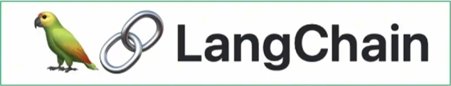
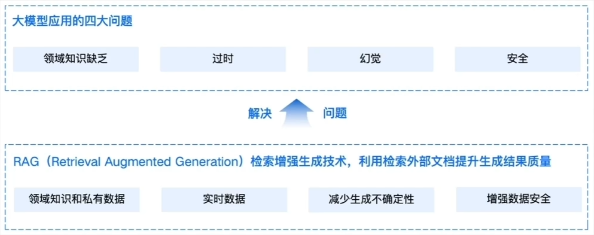
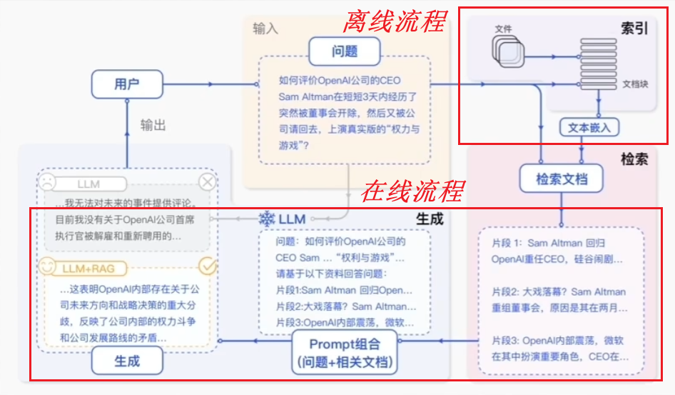
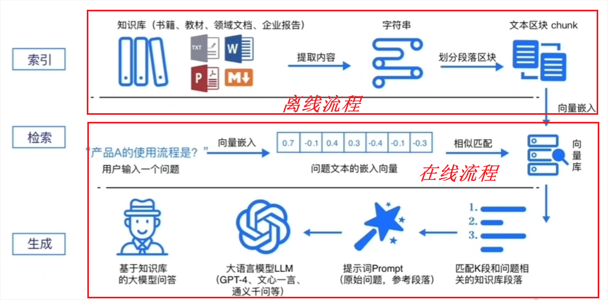
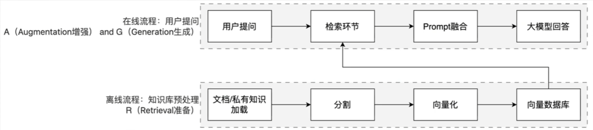
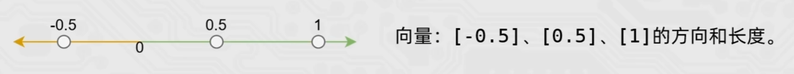
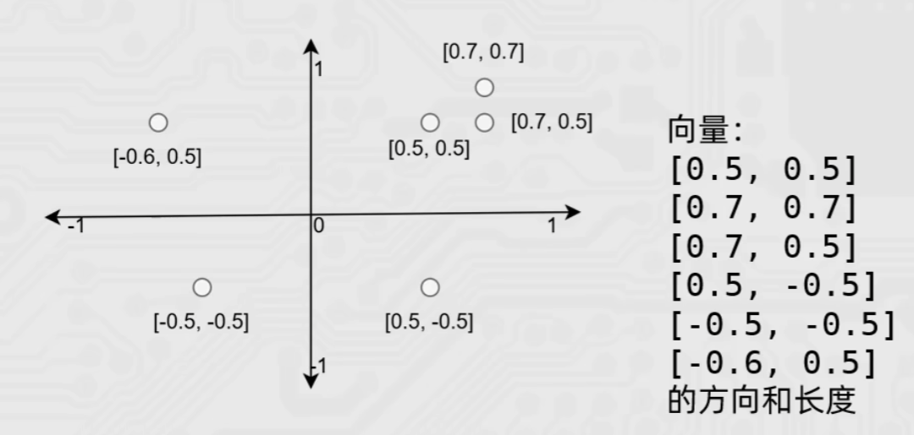
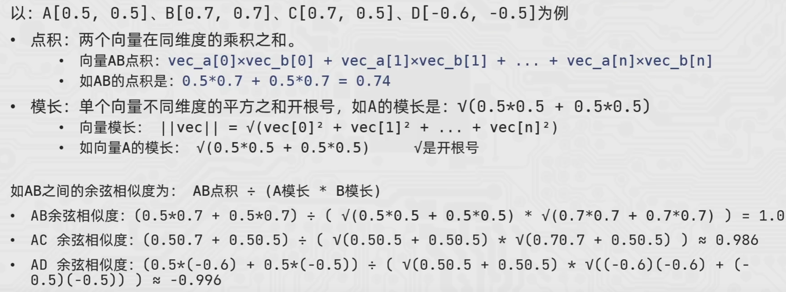

> 本文档为教程拆分章节，完整文档见 [LangChain-Tutorial.md](../LangChain-Tutorial.md)

## 五、RAG 介绍

### LangChain 简介

LangChain 由 Harrison Chase 创建于 2022 年 10 月，它是围绕 LLMs （大语言模型）建立的一个框架



LangChain 自身并不开发 LLMs ，它的核心理念是为各种 LLMs 实现**通用的接口**，把 LLMs 相关的组件“链接”在一起，简化 LLMs 应用的开发难度，方便开发者快速地开发复杂的 LLMs 应用

LangChain 是一个开发 LLM 相关业务功能的集大成者，是一个 python 的第三方库，提供各种功能的 API

LangChain 主要功能

- Prompt 优化提示词（提示词工程）
- Models 调用各种模型
- History 管理会话历史记录（记忆）
- Indexes 管理和分析各类文档
- Chins 构建功能的执行链条（**核心亮点**）
- Agent 构建智能体

“All in LangChain”  —— 一站齐活

### LangChain 环境部署

```cmd
pip install langchain langchain-community langchain-ollama dashscope chromadb
```

- langchain：核心包
- langchain-community：社区支持包，提供了更多的第三方模型调用
- langchain-ollama：ollama 支持包，支持调用 ollama 托管部署的本地模型
- dashscope：阿里云通义千问的 python SDK
- chromadb：轻量向量数据库

### RAG 介绍

通用的基础大模型存在一些问题：

- LLM 的知识不是实时的，模型训练好后不具备自动更新知识的能力，会导致部分信息滞后
- LLM 领域知识是缺乏的，大模型的知识来源于训练数据，这些数据主要来自公开的互联网和开源数据集，无法覆盖特定领域或高度专业化的内部数据
- 幻觉问题，LLM 有时会在回答中生成看似合理但实际上是错误的信息
- 数据安全性



RAG（Retrieval‑Augmented Generation），即检索增强生成，为大模型提供了从特定数据源检索到的信息，以此来修正和补充生成的答案。可以总结为一个公式：
$$
RAG = 检索技术 + LLM 提示
$$

### RAG 的工作原理

#### 工作流程图解



#### RAG 标准流程



简单来说，RAG 工作分为两条线：

- 离线准备线：R
- 在线服务线：A and G



RAG 标准流程由索引（Indexing）、检索（Retriever）和生成（Generation）三个核心阶段组成

- **索引阶段**：通过处理多种来源、多种格式的文档提取其中文本，将其切分为标准长度的文本块（chunk），并进行嵌入向量化（embedding），向量存储在向量数据库（vector database）中。

  加载文件、内容提取、文本分割形成 chunk、文本向量化、存向量数据库

- **检索阶段**：用户输入的查询（query）被转化成向量表示，通过相似度匹配从向量数据库中检索出最相关的文本块

  query 向量化、在文本向量中匹配出与问句向量相似的 top_k 个

- **生成阶段**：检索到的相关文本与原始查询共同构成提示词（Prompt），输入大语言模型（LLM），生成精确且具备上下文关联的回答

  匹配出的文本作为上下文和问题一起添加到 prompt 中、提交给 LLM 生成答案

模型本质上就是用户输入，模型给出输出，用户能做的就是在输入上做功夫

RAG 就是在向模型提问之前基于已有的知识库或文档内容做检索，确保向模型提问的内容更精准以及包含足够的信息量以提供给模型

### 向量的基础概念

RAG 流程中，向量库是一个重要的节点

- 离线流程：知识和信息 —> 向量嵌入（向量化）—> 存入向量库
- 在线流程：用户的提问 —> 向量嵌入（向量化）—> 在向量库中匹配

#### 向量

向量（vector）就是文本的“数学身份证”：它把一段文字的**语义信息**，转换成一串固定长度的**数字列表**，让计算机能“看懂”文字的含义并做相似度计算

简单来说，就是让计算机更方便的理解不同的文本内容，是否表述的是一个意思

#### 文本嵌入模型

文本嵌入模型（如 text-embedding-v1）通过深度学习等技术，从文本提取语义特征并映射为固定长度的数字序列

向量嵌入的过程，我们一般选用合适的文本嵌入模型来完成

在向量匹配的过程中，如何识别 2 段文本是否表述相似的含义，主要可以通过如余弦相似度等算法来完成，比如（数值只做示例，非真实向量）：

- A：“如何快速学会打篮球” —> [ 0.2，0.5，0.8 ]
- B：“打篮球怎么学得快” —> [ 0.18，0.52，0.79 ]
- C：“运动后吃什么好呢” —> [ 0.9，0.1，0.2 ]

通过余弦相似度算法可以得到：A 和 B相似度 0.999789，A 和 C 相似度 0.361446，由此可以通过精确的数学计算，去匹配 2 段文本是否描述同一个意思，提高语义匹配的效率和精度

如何更为精准的完成语义匹配，生成向量的维度是一个很重要的指标

如 text-embedding-v1 模型，可以生成 1536 维的向量（一段文本固定得到 1536 个数字序列），1536 个数字表示，这段文本在 1536 个主题（抽象的语义特征）方向上的得分（强度）

- 生成向量的维度越多，就更好的记录文本的语义特征，做语义匹配会更加精准
- 更多的向量会在计算、存储和匹配过程中，带来更大的压力

选择合适的向量维度需要在精准和性能之间做平衡，一般 1536 维是比较好的选择

#### 余弦相似度算法

向量的数学序列，共同决定了向量在高维空间中的**方向**和**长度**，而余弦相似度主要就是**撇除长度的影响，得到方向的夹角**。夹角越小越相似，即方向相同

以一维向量为例：



以二维向量为例：



三维乃至更高纬度难以描述，但概念一致

在文本向量语义匹配中，余弦相似度是衡量两个向量方向相似程度的核心算法，即判断两端文本语义是否相近
$$
余弦相似度 = 两个向量的点积 / 两个向量模长的乘积
$$
即：
$$
\text{cosine similarity}(\vec A,\vec B)=\frac{\vec A\cdot\vec B}{\|\vec A\| \times \|\vec B\|}
$$


#### 代码实现余弦相似度计算

```python
import numpy as np

"""
计算两个向量的余弦相似度

参数：
    vec_a (np.array): 向量A
    vec_b (np.array): 向量B
返回：
    float: 余弦相似度结果（范围[-1,1]，越接近1方向越一致）
公式：
    cos_sim = (vec_a · vec_b) / (||vec_a|| × ||vec_b||)
    拆解：
    1. 点积：vec_a · vec_b = vec_a[0]×vec_b[0] + vec_a[1]×vec_b[1] + ... + vec_a[n]×vec_b[n]
    2. 模长：||vec_a|| = √(vec_a[0]² + vec_a[1]² + ... + vec_a[n]²)
    3. 模长：||vec_b|| = √(vec_b[0]² + vec_b[1]² + ... + vec_b[n]²)

A: [0.5, 0.5]
B: [0.7, 0.7]
C: [0.7, 0.5]
D: [-0.6, -0.5]
"""

def get_dot(vec_a, vec_b):
    """计算2个向量的点积，2个向量同维度数字乘积之和"""
    if len(vec_a) != len(vec_b):
        raise ValueError("2个向量必须维度数量相同")

    dot_sum = 0
    for a, b in zip(vec_a, vec_b):
        dot_sum += a * b

    return dot_sum

def get_norm(vec):
    """计算单个向量的模长：对向量的每个数字求平方在求和在开根号"""
    sum_square = 0
    for v in vec:
        sum_square += v * v

    # numpy sqrt函数完成开根号
    return np.sqrt(sum_square)

def cosine_similarity(vec_a, vec_b):
    """余弦相似度：2个向量的点积 除以 2个向量模长的乘积"""
    result = get_dot(vec_a, vec_b) / (get_norm(vec_a) * get_norm(vec_b))
    return result

if __name__ == '__main__':
    vec_a = [0.5, 0.5]
    vec_b = [0.7, 0.7]
    vec_c = [0.7, 0.5]
    vec_d = [-0.6, -0.5]
    
    print("ab:", cosine_similarity(vec_a, vec_b))
    print("ac:", cosine_similarity(vec_a, vec_c))
    print("ad:", cosine_similarity(vec_a, vec_d))
```
