> 本文档为教程拆分章节，完整文档见 [LangChain-Tutorial.md](../LangChain-Tutorial.md)

## 六、RAG 开发

现在市面上的模型多如牛毛，各种模型不断出现，LangChain 模型组件提供了与各种模型的集成，并为所有模型提供一个精简的统一接口

LangChain 目前支持三种类型的模型：LLMs（大语言模型）、Chat Models（聊天模型）、Embeddings Models（嵌入模型）

- LLMs：是技术范畴的统称，指基于大量参数、海量文本训练的 Transformer 架构模型，核心能力是理解和生成自然语言，主要服务与文本生成场景
- Chat Models：聊天模型，是应用范畴的细分，是专为对话场景优化的 LLMs，核心能力是模拟人类对话的轮次交互，主要服务与聊天场景
- Embeddings Models：接受文本作为输入，得到文本的向量

LangChain 支持的三类模型，它们的使用场景不同，输入输出不同，开发者需要根据项目需要选择

### LangChain 调用大模型

LLMs 使用场景最多，常用大模型的下载库：

- https://hunggingface.co/models
- https://modelscope.cn/models

同时 LangChain 支持对许多模型的调用，以通义千问为例：

```python
from langchain_community.llms.tongyi import Tongyi

# 实例化模型
model = Tongy(models='qwen-max')

# 推理模型
res = model.invoke(input="帮我讲个笑话")
print(res)
```

如果要访问本地 ollama 模型，只需要通过 `langchain_ollama` 包导入 `OllamaLLM` 类即可

```python
from langchain_ollama import OllamaLLM

model = OllamaLLM(model='qwen3:4b')

res = model.invoke(input="帮我讲个笑话")
print(res)
```

### LangChain 流式输出

如果需要流式输出结果，只需要将 `invoke` 方法改为 `stream` 方法即可

- `invoke`：一次性返回完整结果
- `stream`：逐渐返回结果，流式输出

```python
from langchain_community.llms.tongyi import Tongyi

# 实例化模型
model = Tongy(models='qwen-max')

# 推理模型
res = model.stream(input="帮我讲个笑话")

for chunk in res:
    print(chunk, end="", flush=True)
```

### LangChain 调用聊天模型

聊天模型包含下面几种类型，使用时需要按照约定传入合适的值：

- AIMessage：AI 输入的消息。可以是针对问题的回答
- HumanMessage：用户信息
- SystemMessage：指定模型具体所处环境和背景

#### 云模型

```python
from langchain_community.chat_models.tongyi import ChatTongyi
from langchain_core.messages import HumanMessage, AIMessage, SystemMessage

model = ChatTongyi(model="qwen3-max")

# 准备消息列表
messages = [
    SystemMessage(content="你是一个边塞诗人。"),
    HumanMessage(content="写一首唐诗"),
    AIMessage(content="锄禾日当午，汗滴禾下土，谁知盘中餐，粒粒皆辛苦。"),
    HumanMessage(content="按照你上一个回复的格式，在写一首唐诗。")
]

res = model.stream(input=messages)

# for 循环迭代打印输出，通过 .content 来获取到内容
for chunk in res:
    print(chunk.content, end="", flush=True)
```

#### 本地模型

```python
from langchain_ollama import ChatOllama
from langchain_core.messages import HumanMessage, AIMessage, SystemMessage

model = ChatOllama(model="qwen3:4b")

messages = [
    SystemMessage(content="你是一个边塞诗人。"),
    HumanMessage(content="写一首唐诗"),
    AIMessage(content="锄禾日当午，汗滴禾下土，谁知盘中餐，粒粒皆辛苦。"),
    HumanMessage(content="按照你上一个回复的格式，在写一首唐诗。")
]

res = model.stream(input=messages)

for chunk in res:
    print(chunk.content, end="", flush=True)
```

### LangChain 消息的简写形式

- SystemMessage(content="内容") —> ("system", "内容")
- HumanMessage(content="内容") —> ("human", "内容")
- AIMessage(content="内容") —> ("human", "内容")

```python
from langchain_community.chat_models.tongyi import ChatTongyi

model = ChatTongyi(model="qwen3-max")

messages = [
    ("system", "你是一个边塞诗人。"),
    ("human", "写一首唐诗。"),
    ("ai", "锄禾日当午，汗滴禾下土，谁知盘中餐，粒粒皆辛苦。"),
    ("human", "按照你上一个回复的格式，在写一首唐诗。")
]

res = model.stream(input=messages)

for chunk in res:
    print(chunk.content, end="", flush=True)
```

区别和优势在于：

**使用类对象的形式**

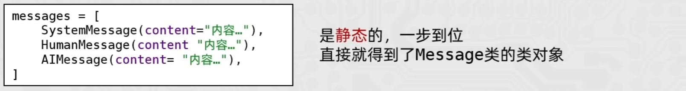

**简写形式**

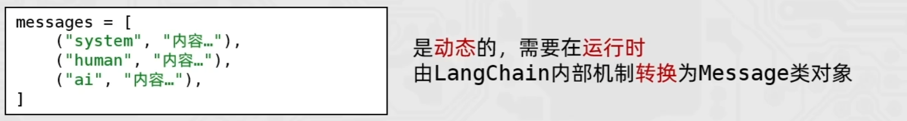

好处在于，简写形式避免导包、写起来更简单，更重要的是支持：

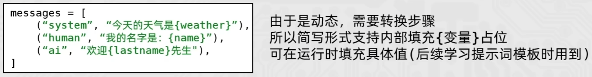

### LangChain 调用嵌入模型

Embedding Models 嵌入模型的特点：将字符串作为输入，返回一个浮点数的列表（向量）。在 NLP 中，Embedding 的作用就是将数据进行文本向量化

#### 云模型

```python
from langchain_community.embeddings import DashScopeEmbeddings

# 创建模型对象 不传model默认用的是 text-embeddings-v1
model = DashScopeEmbeddings()

# embed_query: 单次转换
# embed_documents: 批量转换
print(model.embed_query("我喜欢你"))
print(model.embed_documents(["我喜欢你", "我稀饭你", "晚上吃啥"]))
```

#### 本地模型

```python
from langchain_ollama import OllamaEmbeddings

model = OllamaEmbeddings(model="qwen3-embedding:4b")

print(model.embed_query("我喜欢你"))
print(model.embed_documents(["我喜欢你", "我稀饭你", "晚上吃啥"]))
```

### API 总结

|      方式       | LLMs 大语言模型                                        | 聊天模型                                                     | 文本嵌入模型                                                 |
| :-------------: | ------------------------------------------------------ | ------------------------------------------------------------ | ------------------------------------------------------------ |
|   阿里云千问    | from langchain_community.llms.tongyi<br/>import Tongyi | from langchain_community.chat_models.tongyi<br/>import ChatTongyi | from langchain_community.embeddings<br/>import DashScopeEmbeddings |
| Ollama 本地模型 | from langchain_ollama <br/>import OllamaLLM            | from langchain_ollama <br/>import ChatOllama                 | from langchain_ollama <br/>import OllamaEmbeddings           |
|      方法       | invoke 批量 <br/>stream 流式                           | invoke 批量 <br/>stream 流式                                 | embed_query 单次转换 <br/>embed_documents 批量转换           |

### PromptTemplate 通用提示词模板

提示词优化在模型应用中非常重要，LangChain 提供了 PromptTemplate 类，用来协助优化提示词

PromptTemplate 表示提示词模板，可以构建一个自定义的基础提示词模板，支持变量的注入，最终生成所需的提示词

#### 标准写法

```python
from langchain_core.prompts import PromptTemplate
from langchain_community.llms.tongyi import Tongyi

# zero-shot
prompt_template = PromptTemplate.from_template(
    "我的邻居姓{lastname}, 刚生了{gender}, 你帮我起个名字，简单回答。"
)

# 变量注入，生成提示词文本
prompt_text = prompt_template.format(lastname="张", gender="女儿")

model = Tongyi(model="qwen-max")
res = model.invoke(input=prompt_text)
print(res)
```

这种写法与下面的基础写法有什么区别呢？

```python
lastname = "张"
gender = "女儿"
s = f"我的邻居姓{lastname}, 刚生了{gender}, 你帮我起个名字，简单回答。"
```

区别就是`prompt_template` 是一个 `PromptTemplate` 对象，其为 `Runnable` 接口的子类，可以加入到 LangChain 中的 chain 中

#### 基于 chain 链的写法

```python
from langchain_core.prompts import PromptTemplate
from langchain_community.llms.tongyi import Tongyi

# zero-shot
prompt_template = PromptTemplate.from_template(
    "我的邻居姓{lastname}, 刚生了{gender}, 你帮我起个名字，简单回答。"
)
model = Tongyi(model="qwen-max")

# chain 链
chain = prompt_template | model

# 基于链，调用模型获取结果
res = chain.invoke(input={"lastname": "张", "gender": "女儿"})
print(res)
```

### FewShotPromptTemplate 提示词模板

```python
from langchain_core.prompts import PromptTemplate, FewShotPromptTemplate

few_shot_template = FewShotPromptTemplate(
    example_prompt=None,                      # 示例数据的模板
    examples=None,                            # 示例的数据（用来注入动态数据），list 内套字典
    prefix=None,                              # 示例之前的提示词
    suffix=None,                              # 示例之后的提示词
    input_variables=[]                        # 声明在前缀或后缀中所需要注入的变量名
)
```

#### 案例

```python
from langchain_core.prompts import PromptTemplate, FewShotPromptTemplate
from langchain_community.llms.tongyi import Tongyi

# 示例的模板
example_template = PromptTemplate.from_template("单词：{word}, 反义词：{antonym}")

# 示例的动态数据注入 要求是list内部套字典
examples_data = [
    {"word": "大", "antonym": "小"},
    {"word": "上", "antonym": "下"},
]

few_shot_template = FewShotPromptTemplate(
    example_prompt=example_template,                      
    examples=examples_data,                             
    prefix="告知我单词的反义词，我提供如下的示例：",            
    suffix="基于前面的示例告知我，{input_word}的反义词是？",   
    input_variables=['input_word']                       
)

prompt_text = few_shot_template.invoke(input={"input_word": "左"}).to_string()
print(prompt_text)

model = Tongyi(model="qwen-max")

print(model.invoke(input=prompt_text))
```

### 模板类的 format 和 invoke 方法

在 PromptTemplate（通用提示词模版）、 FewShotPromptTemplate（FewShot 提示词模板）以及 ChatPromptTemplate（对话提示词模板） 都拥有 format 和 invoke 方法

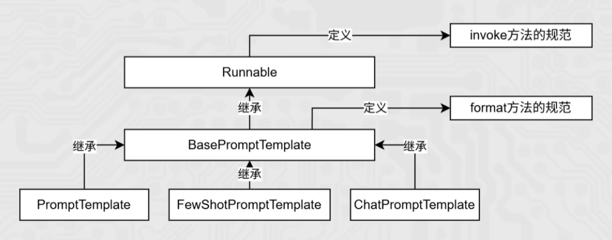

format 和 invoke 的区别：

| 区别     | format                             | invoke                                                |
| -------- | ---------------------------------- | ----------------------------------------------------- |
| 功能     | 纯字符串替换，解析占位符生成提示词 | Runnable 接口标准方法，解析占位符生成提示词           |
| 返回值   | 字符串                             | PromptValue 类对象                                    |
| 传参     | .format(k=v, k=v, ······)          | .invoke({"k":v, "k":v, ······})                       |
| **解析** | 支持解析｛｝占位符                 | 支持解析｛｝占位符和 MessagesPlaceholder 结构化占位符 |

所以前面在查看提示词时用到 `.to_string()`：

```python
prompt_text = few_shot_template.invoke(input={"input_word": "左"}).to_string()
```

```python
from langchain_core.prompts import PromptTemplate
from langchain_core.prompts import FewShotPromptTemplate
from langchain_core.prompts import ChatPromptTemplate
from langchain_community.llms.tongyi import Tongyi
from langchain_community.chat_models.tongyi import ChatTongyi

template = PromptTemplate.from_template("我的邻居是：{lastname}，最喜欢：{hobby}")

res = template.format(lastname="张大明", hobby="钓鱼")
print(res, type(res))
"""
我的邻居是：张大明，最喜欢：钓鱼 
<class 'str'>
"""

res2 = template.invoke({"lastname": "周杰轮", "hobby": "唱歌"})
print(res2, type(res2)
"""
text='我的邻居是：周杰轮，最喜欢：唱歌' 
<class 'langchain_core.prompt_values.StringPromptValue'>
"""
```

### ChatPromptTemplate 提示词模板

- PromptTemplate：通用提示词模板，支持动态注入信息
- FewShotPromptTemplate：支持基于模板注入任意数量的示例信息
- ChatPromptTemplate：支持注入任意数量的**历史会话**信息

通过 `from_messages` 方法，从列表中获取多轮次会话作为聊天的基础模板。前面 `PromptTemplate` 类用的 `from_template` 仅能接入一条消息，而 `from_messages` 可以接入一个 `list` 的消息

历史会话信息并不是静态的（固定的），而是随着对话的进行不停地积攒，即动态的。所以，历史会话信息需要支持动态注入。

```python
from langchain_core.prompts import ChatPromptTemplate, MessagesPlaceholder
from langchain_community.chat_models.tongyi import ChatTongyi

chat_prompt_template = ChatPromptTemplate.from_messages(
    [
        ("system", "你是一个边塞诗人，可以作诗。"),
        MessagesPlaceholder("history"),
        ("human", "请再来一首唐诗"),
    ]
)

history_data = [
    ("human", "你来写一个唐诗"),
    ("ai", "床前明月光，疑是地上霜，举头望明月，低头思故乡"),
    ("human", "好诗再来一个"),
    ("ai", "锄禾日当午，汗滴禾下锄，谁知盘中餐，粒粒皆辛苦"),
]

prompt_text = chat_prompt_template.invoke({"history": history_data}).to_string()

model = ChatTongyi(model="qwen3-max")

res = model.invoke(prompt_text)
print(res.content, type(res))
```

### chains 链的基础使用

「 **将组件串联，上一个组件的输出作为下一个组件的输入** 」是 LangChain 链（尤其是 | 管道链）的核心工作原理，这也是链式调用的核心价值：实现数据的自动化流转与组件的协同工作，如下：

```python
chain = prompt_template | model
```

核心前提：Runnable 的子类对象才能入链（以及 Callable、Mapping 接口子类对象也可加入（用的不多））。

我们目前所学习到的组件，均是Runnable接口的子类，如下类的继承关系：

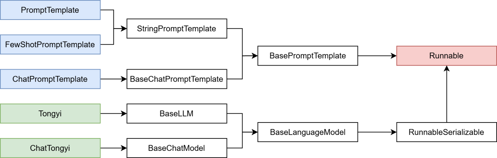

```python
from langchain_core.prompts import ChatPromptTemplate, MessagesPlaceholder
from langchain_community.chat_models.tongyi import ChatTongyi

chat_prompt_template = ChatPromptTemplate.from_messages(
    [
        ("system", "你是一个边塞诗人，可以作诗。"),
        MessagesPlaceholder("history"),
        ("human", "请再来一首唐诗"),
    ]
)

history_data = [
    ("human", "你来写一个唐诗"),
    ("ai", "床前明月光，疑是地上霜，举头望明月，低头思故乡"),
    ("human", "好诗再来一个"),
    ("ai", "锄禾日当午，汗滴禾下锄，谁知盘中餐，粒粒皆辛苦"),
]

model = ChatTongyi(model="qwen3-max")

# 组成链，要求每一个组件都是 Runnable 接口的子类
chain = chat_prompt_template | model

# 通过链去调用 invoke 
# res = chain.invoke({"history": history_data})
# print(res.content)

# 通过 stream 流式输出
for chunk in chain.stream({"history": history_data}):
    print(chunk.content, end="", flush=True)
```

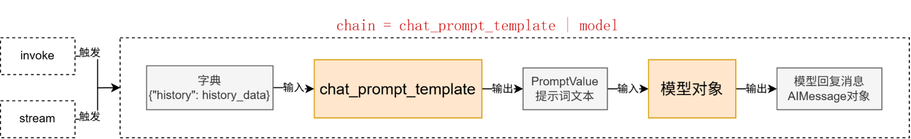

### 拓展：“|” 运算符的重写

前文代码中： `chain = chat_prompt_template | model`，在语法上使用了 | 运算符的重写

在 Python 中，运算符（如 +、|）的行为由类的魔法方法决定。例如：

- a + b 本质调用的是 ：

  ```python
  a.__or__(b)
  ```

- a | b 本质调用的是：

  ```python
  a.__or__(b)
  ```

只需要自行实现类的 or 方法，即可对 | 符号的功能进行重写

### Runnable 接口

LangChain 中的绝大多数核心组件都继承了 Runnable 抽象基类（位于 langchain_core.runnables.base）

chain 变量是 RunnableSequence（RunnableSerializable 子类）类型，而得到这个类型的原因就是 Runnable 基类内部对 or 魔术方法的改写

同时，在后面继续使用 | 添加新的组件，依旧会得到 RunnableSequence，这就是链的基础架构

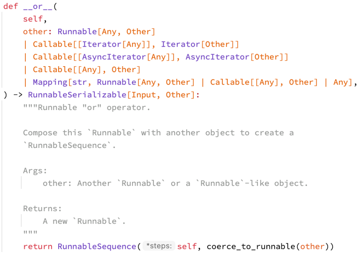

### StrOutputParser 解析器

有如下代码，想要以第一次模型的输出结果，第二次去询问模型：

```python
from langchain_core.prompts import PromptTemplate
from langchain_community.chat_models.tongyi import ChatTongyi

model = ChatTongyi(model="qwen3-max")

prompt = PromptTemplate.from_template(
    "我邻居姓：{lastname}, 刚生了{gender}，请起名，仅告知名字无需其它内容"
)

chain = prompt | model | model

res = chain.invoke({"lastname": "张", "gender": "女儿"})
print(res.content)
```

`chain = prompt | model | model`：

- 链的构建完全符合要求（参与的组件）

- 但是运行报错

- 错误的主要原因是：

  • prompt的结果是 PromptValue 类型，输入给了 model

  • model的输出结果是：AIMessage

模型（ChatTongyi）源码中关于 invoke 方法明确指定了 input 的类型：

```python
@override
def invoke(
    self,
    input: LanguageModelInput,
    config: RunnableConfig | None = None,
    *,
    stop: list[str] | None = None,
    **kwargs: Any,
) -> AIMessage:
```

```python
LanguageModelInput = PromptValue | str | Sequence[MessageLikeRepresentation]
"""Input to a language model."""
```

需要做类型转换

可以借助 LangChain 内置的解析器，StrOutputParser 字符串输出解析器

StrOutputParser 是 LangChain 内置的简单字符串解析器

- 可以将 AIMessage 解析为简单的字符串，符合了模型 invoke 方法要求（可传入字符串，不接收 AIMessage 类型）
- 是 Runnable 接口的子类（可以加入链）

```python
parser = StrOutputParser()
chain = prompt | model | parser | model
```

修改后的代码如下：

```python
from langchain_core.output_parsers import StrOutputParser
from langchain_core.prompts import PromptTemplate
from langchain_community.chat_models.tongyi import ChatTongyi

parser = StrOutputParser()
model = ChatTongyi(model="qwen3-max")
prompt = PromptTemplate.from_template(
    "我邻居姓：{lastname}，刚生了{gender}，请起名，仅告知我名字无需其它内容。"
)

chain = prompt | model | parser | model 

res: AIMessage = chain.invoke({"lastname": "张", "gender": "女儿"})
print(res)

# 如果继续在后面加 | parser
chain = prompt | model | parser | model | parser

res: str = chain.invoke({"lastname": "张", "gender": "女儿"})
print(res.content)
```

### JsonOutputParser 与 多模型执行链

在前面我们完成了这样的需求去构建多模型链，不过这种做法并不标准，因为：

上一个模型的输出，没有被处理就输入下一个模型

正常情况下我们应该有如下处理逻辑：

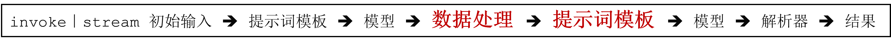

模型输出的数据类型为 AIMessage，而提示词模版的输入类型为 dict：

```python
def invoke(    
    self, input: dict, config: RunnableConfig | None = None, **kwargs: Any
) -> PromptValue:
```

所以，我们需要完成将模型输出的 AIMessage 转为字典注入第二个提示词模板中，形成新的提示词（PromptValue 对象）

- StrOutputParser：AIMessage 输入、str 输出
- JsonOutputParser：AIMessage 输入、dict 输出

#### JsonOutputParser 完成多模型链

```python
from langchain_core.output_parsers import StrOutputParser, JsonOutputParser
from langchain_community.chat_models.tongyi import ChatTongyi
from langchain_core.prompts import PromptTemplate

# 创建所需的解析器
str_parser = StrOutputParser()
json_parser = JsonOutputParser()

# 模型创建
model = ChatTongyi(model="qwen3-max")

# 第一个提示词模板
first_prompt = PromptTemplate.from_template(
    "我邻居姓：{lastname}，刚生了{gender}，请帮忙起名字，"
    "并封装为JSON格式返回给我。要求key是name，value就是你起的名字，请严格遵守格式要求。"
)

# 第二个提示词模板
second_prompt = PromptTemplate.from_template(
    "姓名：{name}，请帮我解析含义。"
)

# 构建链（AIMessage("{name: 张若曦}")
chain = first_prompt | model | json_parser | second_prompt | model | str_parser

for chunk in chain.stream({"lastname": "张", "gender": "女儿"}):
    print(chunk, end="", flush=True)
```

### RunnableLambda 与 自定义函数加入链

前文我们根据 JsonOutputParser 完成了多模型执行链条的构建

我们还可以自己编写 Lambda 匿名函数来完成自定义逻辑的数据转换，想怎么转换就怎么转换，更自由

想要完成这个功能，可以基于RunnableLambda类实现

RunnableLambda 类是 LangChain 内置的，将普通函数等转换为 Runnable 接口实例，方便自定义函数加入 chain

语法：

```python
RunnableLambda( 函数对象 或 lambda 匿名函数 )
```

```python
from langchain_core.output_parsers import StrOutputParser
from langchain_core.prompts import PromptTemplate
from langchain_community.chat_models.tongyi import ChatTongyi
from langchain_core.runnables import RunnableLambda

model = ChatTongyi(model="qwen3-max")
str_parser = StrOutputParser()

first_prompt = PromptTemplate.from_template(
    "我邻居姓：{lastname}，刚生了{gender}，请帮忙起名字，仅生成一个名字，并告知我名字，不要额外信息。"
)

second_prompt = PromptTemplate.from_template(
    "姓名{name}，请帮我解析含义。"
)

# 函数的入参：AIMessage -> dict  ({"name": "xxx"})
my_func = RunnableLambda(lambda ai_msg: {"name": ai_msg.content})

chain = first_prompt | model | my_func | second_prompt | model | str_parser

for chunk in chain.stream({"lastname": "曹", "gender": "女孩"}):
    print(chunk, end="", flush=True)
```

其中 `my_func` 接受来自 `model` 的输出（AIMessage），返回 `{"name": 模型输出的结果 }` 

跳过 RunnableLambda 类，直接让函数加入链也是可以的。因为 Runnable 接口类在实现 or 的时候，支持 Callable 接口的实例（函数就是 Callable 接口的实例）：

```python
def __or__(
    self,
    other: Runnable[Any, Other]
    | Callable[[Iterator[Any]], Iterator[Other]]
    | Callable[[AsyncIterator[Any]], AsyncIterator[Other]]
    | Callable[[Any], Other]
    | Mapping[str, Runnable[Any, Other] | Callable[[Any], Other] | Any],
) -> RunnableSerializable[Input, Other]:
```

如上代码示例，| 符号（底层是调用 or）组链，是支持函数加入的。其本质是将函数**自动转换为 RunnableLambda**

```python
 chain = first_prompt | model | (lambda ai_msg: {"name": ai_msg.content}) | second_prompt | model | str_parser
```

### Memory 临时会话记忆

如果想要封装历史记录，除了自行维护历史消息外，也可以借助 LangChain 内置的历史记录附加功能

LangChain提供了History功能，帮助模型在有历史记忆的情况下回答

- 基于 RunnableWithMessageHistory 在原有链的基础上创建带有历史记录功能的新链（新 Runnable 实例）
- 基于 InMemoryChatMessageHistory 为历史记录提供内存存储（临时用）

```python
from langchain_core.runnables.history import RunnableWithMessageHistory

# 通过 RunnableWithMessageHistory 获取一个新的带有历史记录功能的 chain ( conversation_chain )
conversation_chain = RunnableWithMessageHistory(
    some_chain,                           # 被附加历史消息的 Runnable，通常是 chain
    None,                                 # 获取指定会话 ID 的历史会话的函数
    input_messages_key="input",           # 声明用户输入消息在模板中的占位符
    history_messages_key="chat_history"   # 声明历史消息在模板中的占位符
)
```

其中 `None` 中提供 ID，返回历史会话记录，其中历史会话记录封装在 InMemoryChatMessageHistory 中

```python
# 获取指定会话 ID 的历史会话记录函数
chat_history_store = {}            # 存放多个会话 ID 所对应的历史会话记录
# 函数传入为会话 ID（字符串类型）
# 函数要求返回 BaseChatMessageHistory 的子类
# BaseChatMessageHistory 类专用于存放某个会话的历史记录
# InMemoryChatMessageHistory 是官方自带的基于内存存放历史记录的类
def get_history(session_id):
    if session_id not in chat_history_store:
        # 返回一个新的实例
        chat_history_store[session_id] = InMemoryChatMessageHistory()
        return chat_history_store[session_id]
```

完整代码

```python
from langchain_community.chat_models.tongyi import ChatTongyi
from langchain_core.prompts import PromptTemplate, ChatPromptTemplate, MessagesPlaceholder
from langchain_core.output_parsers import StrOutputParser
from langchain_core.runnables.history import RunnableWithMessageHistory
from langchain_core.chat_history import InMemoryChatMessageHistory

model = ChatTongyi(model="qwen3-max")
str_parser = StrOutputParser()
prompt = PromptTemplate.from_template(
    "你需要根据会话历史回应用户问题。对话历史：{chat_history}，用户提问：{input}，请回答"
)
"""
# 优化：
prompt = ChatPromptTemplate.from_messages(
    [
        ("system", "你需要根据会话历史回应用户问题。对话历史："),
        MessagesPlaceholder("chat_history"),
        ("human", "请回答如下问题：{input}")
    ]
)
"""

def print_prompt(full_prompt):
    print("="*20, full_prompt.to_string(), "="*20)
    return full_prompt

base_chain = prompt | print_prompt | model | str_parser

store = {}      # key 就是 session，value 就是 InMemoryChatMessageHistory 类对象
# 实现通过会话 id 获取 InMemoryChatMessageHistory 类对象
def get_history(session_id):
    if session_id not in store:
        store[session_id] = InMemoryChatMessageHistory()

    return store[session_id]

# 创建一个新的链，对原有链增强功能：自动附加历史消息
conversation_chain = RunnableWithMessageHistory(
    base_chain,     				    # 被增强的原有 chain
    get_history,    				    # 通过会话 id 获取 InMemoryChatMessageHistory 类对象
    input_messages_key="input",         # 表示用户输入在模板中的占位符
    history_messages_key="chat_history" # 表示历史消息在模板中的占位符
)

if __name__ == '__main__':
    # 固定格式，添加 LangChain 的配置，为当前程序配置所属的 session_id
    session_config = {
        "configurable": {
            "session_id": "user_001"
        }
    }

    res = conversation_chain.invoke({"input": "小明有2个猫"}, session_config)
    print("第1次执行：", res)
    res = conversation_chain.invoke({"input": "小刚有1只狗"}, session_config)
    print("第2次执行：", res)
    res = conversation_chain.invoke({"input": "总共有几个宠物"}, session_config)
    print("第3次执行：", res)
```

### Memory 长期会话记忆

使用 InMemoryChatMessageHistory 仅可以在内存中临时存储会话记忆，一旦程序退出，则记忆丢失

InMemoryChatMessageHistory 类继承自 BaseChatMessageHistory，在官方注释中给出了相关实现的指南，并给出了基于文件的历史消息存储示例代码：

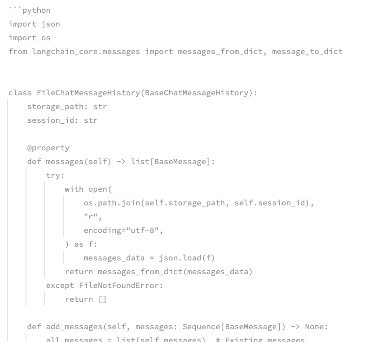

我们可以自行实现一个基于 Json 格式和本地文件的会话数据保存

FileChatMessageHistory 类实现，核心思路：

- 基于文件存储会话记录，以 session_id 为文件名，不同 session_id 有不同文件存储消息

- 继承 BaseChatMessageHistory 实现如下3个方法：

  •  add_messages：同步模式，添加消息

  •  messages：同步模式，获取消息

  •  clear：同步模式，清除消息

如下面代码，官方在 BaseChatMessageHistory 类的注释中提供了一个基于文件存储的示例代码：

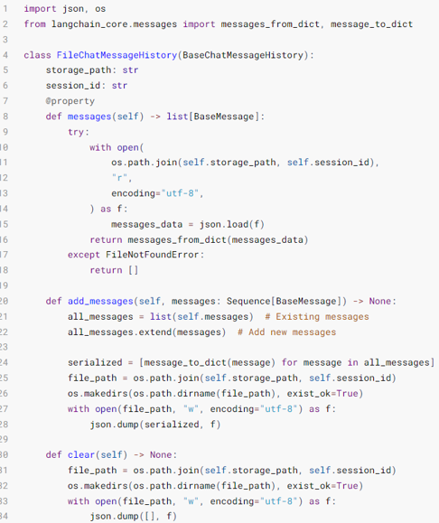

```python
from __future__ import annotations

import os, json
from typing import Sequence

from langchain_community.chat_models import ChatTongyi
from langchain_core.messages import message_to_dict, messages_from_dict, BaseMessage
from langchain_core.chat_history import BaseChatMessageHistory
from langchain_core.output_parsers import StrOutputParser
from langchain_core.prompts import ChatPromptTemplate, MessagesPlaceholder
from langchain_core.runnables import RunnableWithMessageHistory

# message_to_dict：单个消息对象（BaseMessage 类实例） -> 字典
# messages_from_dict：[字典、字典...]  -> [消息、消息...]
# AIMessage、HumanMessage、SystemMessage 都是 BaseMessage 的子类

class FileChatMessageHistory(BaseChatMessageHistory):
    def __init__(self, session_id, storage_path):
        self.session_id = session_id        # 会话 id
        self.storage_path = storage_path    # 不同会话 id 的存储文件，所在的文件夹路径
        # 完整的文件路径
        self.file_path = os.path.join(self.storage_path, self.session_id)
        # 确保文件夹是存在的
        os.makedirs(os.path.dirname(self.file_path), exist_ok=True)

    def add_messages(self, messages: Sequence[BaseMessage]) -> None:
        # Sequence序列 类似list、tuple
        all_messages = list(self.messages)      # 已有的消息列表
        all_messages.extend(messages)           # 新的和已有的融合成一个 list

        # 将数据同步写入到本地文件中
        # 类对象写入文件 -> 一堆二进制
        # 为了方便，可以将 BaseMessage 消息转为字典（借助 json 模块以 json 字符串写入文件）
        # 官方 message_to_dict：单个消息对象（BaseMessage 类实例） -> 字典
        # new_messages = []
        # for message in all_messages:
        #     d = message_to_dict(message)
        #     new_messages.append(d)

        new_messages = [message_to_dict(message) for message in all_messages]
        # 将数据写入文件
        with open(self.file_path, "w", encoding="utf-8") as f:
            json.dump(new_messages, f)

    @property       # @property 装饰器将 messages 方法变成成员属性用
    def messages(self) -> list[BaseMessage]:
        # 当前文件内： list[字典]
        try:
            with open(self.file_path, "r", encoding="utf-8") as f:
                messages_data = json.load(f)    # 返回值就是：list[字典]
                return messages_from_dict(messages_data)
        except FileNotFoundError:
            return []

    def clear(self) -> None:
        with open(self.file_path, "w", encoding="utf-8") as f:
            json.dump([], f)

model = ChatTongyi(model="qwen3-max")
# prompt = PromptTemplate.from_template(
#     "你需要根据会话历史回应用户问题。对话历史：{chat_history}，用户提问：{input}，请回答"
# )
prompt = ChatPromptTemplate.from_messages(
    [
        ("system", "你需要根据会话历史回应用户问题。对话历史："),
        MessagesPlaceholder("chat_history"),
        ("human", "请回答如下问题：{input}")
    ]
)

str_parser = StrOutputParser()

def print_prompt(full_prompt):
    print("="*20, full_prompt.to_string(), "="*20)
    return full_prompt

base_chain = prompt | print_prompt | model | str_parser

def get_history(session_id):
    return FileChatMessageHistory(session_id, "./chat_history")

# 创建一个新的链，对原有链增强功能：自动附加历史消息
conversation_chain = RunnableWithMessageHistory(
    base_chain,     # 被增强的原有chain
    get_history,    # 通过会话id获取InMemoryChatMessageHistory类对象
    input_messages_key="input",             # 表示用户输入在模板中的占位符
    history_messages_key="chat_history"     # 表示用户输入在模板中的占位符
)

if __name__ == '__main__':
    # 固定格式，添加 LangChain 的配置，为当前程序配置所属的 session_id
    session_config = {
        "configurable": {
            "session_id": "user_001"
        }
    }

    res = conversation_chain.invoke({"input": "小明有2个猫"}, session_config)
    print("第1次执行：", res)
    res = conversation_chain.invoke({"input": "小刚有1只狗"}, session_config)
    print("第2次执行：", res)
    res = conversation_chain.invoke({"input": "总共有几个宠物"}, session_config)
    print("第3次执行：", res)
```

### Document loaders 文档加载器

文档加载器提供了一套标准接口，用于将不同来源（如 CSV、PDF 或 JSON等）的数据读取为 LangChain 的文档格式。这确保了无论数据来源如何，都能对其进行一致性处理

文档加载器（内置或自行实现）需实现 BaseLoader 接口

**Class Document**，是 LangChain 内文档的统一载体，所有文档加载器最终返回此类的实例

一个基础的 Document 类实例，基于如下代码创建：

```python
from langchain_core.documents import Document

document = Document(
    page_content="Hello, world!", metadata={"source": "https://example.com"}
)
```

可以看到，Document 类其核心记录了：

- page_content：文档内容
- metadata：文档元数据（字典）

不同的文档加载器可能定义了不同的参数，但是其都实现了统一的接口（方法）

- load()：一次性加载全部文档
- lazy_load()：延迟流式传输文档，对大型数据集很有用，避免内存溢出

一个简单的 CSVLoader 的使用示例如下：

```python
from langchain_community.document_loaders.csv_loader import CSVLoader
loader = CSVLoader(
	......         # 初始化参数
)

# 一次性加载全部文档
documents = loader.load()

# 对于大数据集，分段返回文档
for document in loader.lazy_load():
	print(document)
```

LangChain 内置了许多文档加载器，详细参见官方文档：

https://docs.langchain.com/oss/python/integrations/document_loaders

我们简单的学习如下几个常用的文档加载器：

- CSVLoader
- JSONLoader
- PDFLoader

### CSVLoader

#### 简单示例：

```python
from langchain_community.document_loaders.csv_loader import CSVLoader

loader = CSVLoader(file_path="./xxx.csv")

data = loader.load()
print(data)
```

#### 自定义 CSV 文件的解析和加载：

```python
from langchain_community.document_loaders.csv_loader import CSVLoader

loader = CSVLoader(
    file_path=“./xxx.csv”,
    csv_args={
        “delimiter”: ",",         # 指定分隔符
        “quotechar”: '"'          # 指定字符串的引号包裹
        # 字段列表（无表头使用，有表头勿用会读取首行做为数据）
        "fieldnames": ["name", "age", "gender"],
    },
)

data = loader.load()
print(data)
```

#### 实战运用

```python
from langchain_community.document_loaders import CSVLoader

loader = CSVLoader(
    file_path="./data/stu.csv",
    csv_args={
        "delimiter": ",",      
        "quotechar": '"',    
        "fieldnames": ['name', 'age', 'gender', '爱好']
    },
    encoding="utf-8"            # 指定编码为UTF-8
)

# 批量加载 .load()   ->  [Document, Document, ...]
# documents = loader.load()
#
# for document in documents:
#     print(type(document), document)

# 懒加载  .lazy_load()  迭代器 [Document]
for document in loader.lazy_load():
    print(document)
```

### JSONLoader

JSONLoader 用于将J SON 数据加载为 Document 类型对象

使用 JSONLoader 需要额外安装 jq：

```cmd
pip install jq
```

jq 是一个跨平台的 json 解析工具，LangChain 底层对 JSON 的解析就是基于 jq 工具实现的。将 JSON 数据的信息抽取出来，封装为 Document 对象，抽取的时候依赖 jq_schema 语法

简单示例 （json 对象）：

```json
{
    "name": "周杰轮",
    "age": 11,
    "hobby": ["唱", "跳", "RAP"],
    "other": {
        "addr": "深圳",
        "tel": "12332112321"
     }
}
```

- . 表示整个 JSON 对象（根）
- [] 表示数组
- .name 表示抽取“周杰轮”
- .hobby 表示抽取“爱好”数组
- .hobby[1] 或 .hobby.[1] 表示抽取“跳”
- .other.addr 表示抽取“深圳”

简单示例 （json 数组）：

```python
[
    {"name": "周杰轮", "age": 11, "gender": "男"},
    {"name": "蔡依临", "age": 12, "gender": "女"},
    {"name": "王力鸿", "age": 11, "gender": "男"}
]
```

- .[]. 得到 3 个字典
- .[].name 表示抽取全部的 name，即得到 3 个 name 信息

简单示例：

```python
from langchain_community.document_loaders import JSONLoader
loader = JSONLoader(
    file_path="xxx.json",   # 文件路径
    jq_schema=".",          # jq schema 语法
    text_content=False,     # 抽取的是否是字符串，默认 True
    json_lines=True,        # 是否是 JsonLines 文件（每一行都是 JSON 的文件）
)
```

如下是一个典型的 JsonLines 文件，如果是该类型的文件需要 `json_lines=True`

```
{"name": "周杰轮", "age": 11, "gender": "男"}
{"name": "蔡依临", "age": 12, "gender": "女"}
{"name": "王力鸿", "age": 11, "gender": "男"}
```

#### 实战运用 1

stu.json：

```
{
    "name": "周杰轮",
    "age": 11,
    "hobby": ["唱", "跳", "RAP"],
    "other": {
        "addr": "深圳",
        "tel": "12332112321"
    }
}
```

```python
from langchain_community.document_loaders import JSONLoader

# stu.json
loader = JSONLoader(
    file_path="./data/stu.json",
    jq_schema=".name",        		  # "周杰轮"
    # jq_schema=".other.addr",        # "深圳"
    # jq_schema=".",          		  # 整个数据
)

"""
loader = JSONLoader(
    file_path="./data/stu.json",
    jq_schema=".",          		  # 整个数据
    text_content=False,     		  # 告知 JSONLoader, 我抽取的内容不是字符串
)
"""

document = loader.load()
print(document)
```

#### 实战运用 2

stus.json：

```python
[
    {"name": "周杰轮", "age": 11, "gender": "男"},
    {"name": "蔡依临", "age": 12, "gender": "女"},
    {"name": "王力鸿", "age": 11, "gender": "男"}
]
```

```python
# stus.json
loader = JSONLoader(
    file_path="./data/stus.json",
    jq_schema=".[].name",     # 所有 "name"
    text_content=False,       # 告知 JSONLoader 我抽取的内容不是字符串
 )

document = loader.load()
print(document)
```

#### 实战运用 3

stu_json_lines.json：

```python
{"name": "周杰轮", "age": 11, "gender": "男"}
{"name": "蔡依临", "age": 12, "gender": "女"}
{"name": "王力鸿", "age": 11, "gender": "男"}
```

```python
# stu_json_lines.json
loader = JSONLoader(
    file_path="./data/stu_json_lines.json",
    jq_schema=".name",
    text_content=False,       # 告知 JSONLoader 我抽取的内容不是字符串
    json_lines=True           # 告知 JSONLoader 这是一个 JSONLines 文件（每一行都是一个独立的标准 JSON）
)

document = loader.load()
print(document)
```

### TextLoader 和 文档分割器

基本的加载器：TextLoader，作用是读取文本文件（如.txt），将全部内容放入一个 Document 对象中

#### 简单示例：

```python
from langchain_community.document_loaders import TextLoader

loader = TextLoader(
    "xxx.txt",                                                                         		encoding="utf-8",                                                                     
)

docs = loader.load()
print(docs)
print(len(docs))	# 结果为 1
```

如果文档很大，加载到一个 Document 对象中就不太合适了

RecursiveCharacterTextSplitter（递归字符文本分割器），主要用于按自然段落分割大文档，是 LangChain 官方推荐的默认字符分割器。它在保持上下文完整性和控制片段大小之间实现了良好平衡，开箱即用效果佳

```cmd
pip install langchain_text_splitters
```

```python
from langchain_community.document_loaders import TextLoader
from langchain_text_splitters import RecursiveCharacterTextSplitter

loader = TextLoader(
    "./data/Python基础语法.txt",
    encoding="utf-8",
)
docs = loader.load()

splitter = RecursiveCharacterTextSplitter(
    chunk_size=500,     # 分段的最大字符数
    chunk_overlap=50,   # 分段之间允许重叠的字符数, 确保语义连贯
    # 文本分段依据
    separators=["\n\n", "\n", "。", "！", "？", ".", "!", "?", " ", ""],
    # 字符统计依据（函数）
    length_function=len,
)

split_docs = splitter.split_documents(docs)
```

- docs：[ Document  ]
- split_docs：[ Document  , Document  , Document  ······ ]

#### 实战运用

```python
from langchain_community.document_loaders import TextLoader
from langchain_text_splitters import RecursiveCharacterTextSplitter

loader = TextLoader("./data/Python基础语法.txt", encoding="utf-8")

docs = loader.load()      	  # [Document]

splitter = RecursiveCharacterTextSplitter(
    chunk_size=500,         
    chunk_overlap=50,       
    separators=["\n\n", "\n", "。", "！", "？", ".", "!", "?", " ", ""],
    length_function=len,   	  # 统计字符的依据函数
)

split_docs = splitter.split_documents(docs)

# print(split_docs)
print(len(split_docs))
for doc in split_docs:
    print(doc)
    print("="*20)
```

### PyPDFLoader

LangChain 内支持许多 PDF 的加载器，我们选择其中的 PyPDFLoader 使用。PyPDFLoader 加载器，依赖 PyPDF 库，所以需要安装它：

```cmd
pip install pypdf
```

如下代码即可快速加载 PDF 中的文字内容了：

```python
from langchain_community.document_loaders import PyPDFLoader

loader = PyPDFLoader(
    file_path="",   # 文件路径必填
    mode='page',   	# 读取模式，可选 page（按页面划分不同 Document）和 single（单个Document）
    password='password',  # 文件密码
)
```

### Vector stores 向量存储

基于 LangChain 的向量存储，存储嵌入数据，并执行相似性搜索

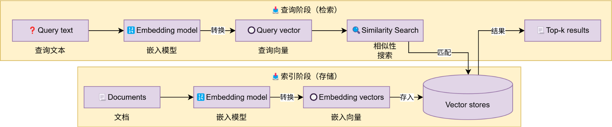

如图，这是一个典型的向量存储应用，也即是典型的 RAG 流程，这部分开发主要涉及到：

- 文本转向量（前文已经学习）

- 创建向量存储，基于向量存储完成：

  •  存入向量

  •  删除向量

  •  向量检索

针对存 / 删 / 检 三个步骤，LangChain 为向量存储提供了统一接口：

- add_documents
- delete
- similarity_search

#### 内置向量存储的使用

```python
from langchain_core.vectorstores import InMemoryVectorStore
from langchain_community.embeddings import DashScopeEmbeddings

vector_store = InMemoryVectorStore(embedding=DashScopeEmbeddings())

# 添加文档到向量存储，并指定id
vector_store.add_documents(documents=[doc1, doc2], ids=["id1", "id2"])

# 删除文档（通过指定的id删除）
vector_store.delete(ids=["id1"])

# 相似性搜索
similar_docs = vector_store.similarity_search("your query here", 4)
```

#### 实战运用

info.csv

```python
source,info
AAA,Python 是世界上最好的编程语言
BBB,我要学 python
AAA,LangChain 极大地方便了大模型开发
AAA,AI 和 Python 是下一个十年的风口
BBB,Python 学起来很简单的
AAA,学习 Python 键盘敲烂月薪过万
AAA,努力带来成就，Python 助力辉煌
AAA,学习 Python 的时候也要记得好好休息打打篮球
AAA,明天晚上吃啥子呀
BBB,如何快速减肥呢
```

```python
from langchain_core.vectorstores import InMemoryVectorStore
from langchain_community.embeddings import DashScopeEmbeddings
from langchain_community.document_loaders import CSVLoader

# 文本转向量的模型用哪个？
vector_store = InMemoryVectorStore(
    embedding=DashScopeEmbeddings()
)

loader = CSVLoader(
    file_path="./data/info.csv",
    encoding="utf-8",
    source_column="source",     # 指定本条数据的来源是哪里
)

# 全量加载
documents = loader.load()
print(documents[1])             # "Python 是世界上最好的编程语言", source: AAA

# id1 id2 id3 id4 ...
# 向量存储的 新增、删除、检索
vector_store.add_documents(
    documents=documents,        # 被添加的文档，类型：list[Document]
    ids=["id"+str(i) for i in range(1, len(documents)+1)]    # 给添加的文档提供 id（字符串）  list[str]
)

# 删除  传入 [id, id...]
vector_store.delete(["id1", "id2"])

# 检索 返回类型 list[Document]
result = vector_store.similarity_search(
    "python 是不是简单易学呀",
    1                           # 检索的结果要几个
)

print(result)
```

#### 外部（Chroma）向量存储的使用

```python
pip install langchain-chroma chromadb
```

```python
from langchain_community.embeddings import DashScopeEmbeddings
from langchain_chroma import Chroma

vector_store = Chroma(
    collection_name="example_collection",       # 当前向量存储名字，类似数据库的表名称
    embedding_function=DashScopeEmbeddings(),   # 嵌入模型
    persist_directory="./chroma_langchain_db",  # 指定数据存放的文件夹
)
```

#### 实战运用

```python
from langchain_chroma import Chroma
from langchain_community.embeddings import DashScopeEmbeddings
from langchain_community.document_loaders import CSVLoader

# Chroma 向量数据库（轻量级的）
vector_store = Chroma(
    collection_name="test",                        
    embedding_function=DashScopeEmbeddings(),       
    persist_directory="./chroma_db"                 
)

loader = CSVLoader(
     file_path="./data/info.csv",
     encoding="utf-8",
     source_column="source",    
)

documents = loader.load()

vector_store.add_documents(
     documents=documents,       
     ids=["id"+str(i) for i in range(1, len(documents)+1)]
 )

 # 删除  
 vector_store.delete(["id1", "id2"])

# 检索 
result = vector_store.similarity_search(
    "Python 是不是简单易学呀",
    1,       
    filter={"source": "BBB"}                # 数据过滤
)

print(result)
```

项目目录中会自动多出来一个 `chroma_db` 文件

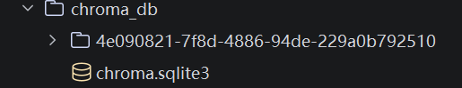

点击 `chroma.sqlite3` ，再点击弹出页面左下角的测试连接，在右侧虚拟表中可以查看存储的数据：

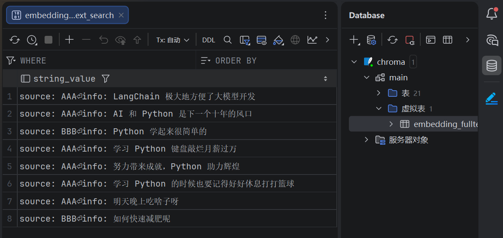

### 检索向量并构建提示词

```python
"""
提示词：用户的提问 + 向量库中检索到的参考资料
"""
from langchain_community.chat_models import ChatTongyi
from langchain_core.vectorstores import InMemoryVectorStore
from langchain_community.embeddings import DashScopeEmbeddings
from langchain_core.prompts import ChatPromptTemplate
from langchain_core.output_parsers import StrOutputParser

def print_prompt(prompt):
    print(prompt.to_string())
    print("=" * 20)
    return prompt

model = ChatTongyi(model="qwen3-max")
prompt = ChatPromptTemplate.from_messages(
    [
        ("system", "以我提供的已知参考资料为主，简洁和专业的回答用户问题。参考资料:{context}。"),
        ("user", "用户提问：{input}")
    ]
)

vector_store = InMemoryVectorStore(embedding=DashScopeEmbeddings(model="text-embedding-v4"))

# 准备一下资料（向量库的数据）
# add_texts 传入一个 list[str] ( 临时用 )
vector_store.add_texts(
    ["减肥就是要少吃多练", "在减脂期间吃东西很重要,清淡少油控制卡路里摄入并运动起来", "跑步是很好的运动哦"])

input_text = "怎么减肥？"

# 检索向量库
result = vector_store.similarity_search(input_text, 2)

reference_text = "["
for doc in result:
    reference_text += doc.page_content
reference_text += "]"
# print(reference_text)
# [减肥就是要少吃多练在减脂期间吃东西很重要,清淡少油控制卡路里摄入并运动起来]

chain = prompt | print_prompt | model | StrOutputParser()

res = chain.invoke({"input": input_text, "context": reference_text})
print(res)
```

### RunnablePassthrough 的使用

能不能让向量检索加入链？

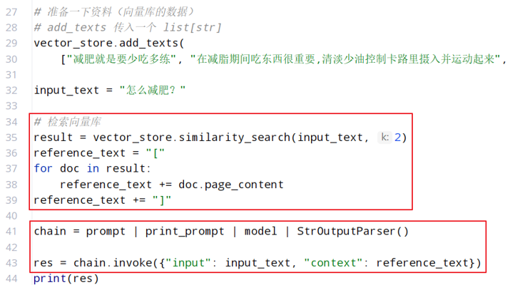

InMemoryVectorStore 不是 Runnable 接口的子类实例对象，不能入链。langchain 中向量存储对象，有一个方法：as_retriever，可以返回一个 Runnable 接口的子类实例对象：

```python
retriever = vector_store.as_retriever(search_kwargs={"k": 2})
```

`retriever` 就是 Runnable 接口的子类实例对象

那么 retriever 可以入链了吗？

```python
chain = retriever | prompt | model | StrOutputParser()
```

我们观察一下 `retriever` 和 `prompt` 的输入输出：

```python
"""
retriever:
    - 输入：用户的提问        		    str
    - 输出：向量库的检索结果			  list[Document]
prompt:
    - 输入：用户的提问 + 向量库的检索结果  dict
    - 输出：完整的提示词                 PromptValue
"""
```

`list[Document]` 类型不能作为 `prompt` 的输入，显然 `retriever` 还不能入链，并且 `prompt` 还会丢失 `用户的提问` 

不管 `prompt` 和 `retriever` 谁在前，都会丢失 `用户的提问` ，如何做到将 `用户的提问` 同时传给 `prompt` 和 `retriever` 呢？

我们可以使用 RunnablePassthrough：

```python
chain = (
    {"input": RunnablePassthrough(), "context": retriever | format_func} | prompt | print_prompt | model | StrOutputParser()
)
```

在这里我们将字典 `{"input": RunnablePassthrough(), "context": retriever | format_func}` 入链了，字典可以入链吗？我们可以查看 `|` 方法：

```python
def __or__(
    self,
    other: Runnable[Output, Other]
    | Callable[[Iterator[Output]], Iterator[Other]]
    | Callable[[AsyncIterator[Output]], AsyncIterator[Other]]
    | Callable[[Output], Other]
    | Mapping[str, Runnable[Output, Any] | Callable[[Output], Any] | Any],
) -> RunnableSerializable[Input, Any]:
```

`Callable` 是函数，其中的 `Mapping` 就是字典的顶级父类，也就是说字典可以入链

现在的 `chain` 是如何工作的呢？

`chain` 是一个大链套了一个小链，大链就是 `chain`，小链就是 `retriever | format_func`，第一个入链的组件是 `retriever`。当链 .invoke() 时，输入会给 `retriever`，而 `RunnablePassthrough()` 相当于一个占位符，也会将 invoke 的输入带走，input 的值会分别输入给 这两个组件，而 `prompt` 的输入由 `retriever` 提供。其中 `format_func` 是将 `retriever` 的输出类型 list[Document] 转化成字符串

#### 实战运用

```python
from langchain_community.chat_models import ChatTongyi
from langchain_core.documents import Document
from langchain_core.runnables import RunnablePassthrough
from langchain_core.vectorstores import InMemoryVectorStore
from langchain_community.embeddings import DashScopeEmbeddings
from langchain_core.prompts import ChatPromptTemplate
from langchain_core.output_parsers import StrOutputParser

def print_prompt(prompt):
    print(prompt.to_string())
    print("=" * 20)
    return prompt

model = ChatTongyi(model="qwen3-max")
prompt = ChatPromptTemplate.from_messages(
    [
        ("system", "以我提供的已知参考资料为主，简洁和专业的回答用户问题。参考资料:{context}。"),
        ("user", "用户提问：{input}")
    ]
)

vector_store = InMemoryVectorStore(embedding=DashScopeEmbeddings(model="text-embedding-v4"))

vector_store.add_texts(
    ["减肥就是要少吃多练", "在减脂期间吃东西很重要,清淡少油控制卡路里摄入并运动起来", "跑步是很好的运动哦"])

input_text = "怎么减肥？"

retriever = vector_store.as_retriever(search_kwargs={"k": 2})

def format_func(docs: list[Document]):
    if not docs:
        return "无相关参考资料"

    formatted_str = "["
    for doc in docs:
        formatted_str += doc.page_content
    formatted_str += "]"

    return formatted_str

chain = (
    {"input": RunnablePassthrough(), "context": retriever | format_func} | prompt | print_prompt | model | StrOutputParser()
)

res = chain.invoke(input_text)
print(res)
```
