> 本文档为教程拆分章节，完整文档见 [LangChain-Tutorial.md](../LangChain-Tutorial.md)

## 七、Agent 智能体

### Agent 简介

智能体是一种能够自主规划、决策、执行任务的组件，核心是让大语言模型（LLM）根据任务需求，选择并调用工具，完成单靠模型自身无法解决的复杂问题

- 没有 Agent 时，LLM 只能基于自身训练数据回答问题，遇到需要实时数据、复杂计算、外部工具调用的场景会卡壳
- 有了 Agent 后，LLM 就像一个“指挥官”，能思考任务步骤 ——> 选择合适工具 ——> 执行工具调用 ——> 根据结构调整策略，直到完成任务 

Agent 核心特点：

- 目标驱动：围绕用户的具体任务目标展开工作
- 工具调用能力：能连接外部工具，弥补 LLM 的局限性
- 自主决策与迭代：不需要人工干预，能根据工具返回的结果，判断是否需要继续调用工具，或直接生成最终答案

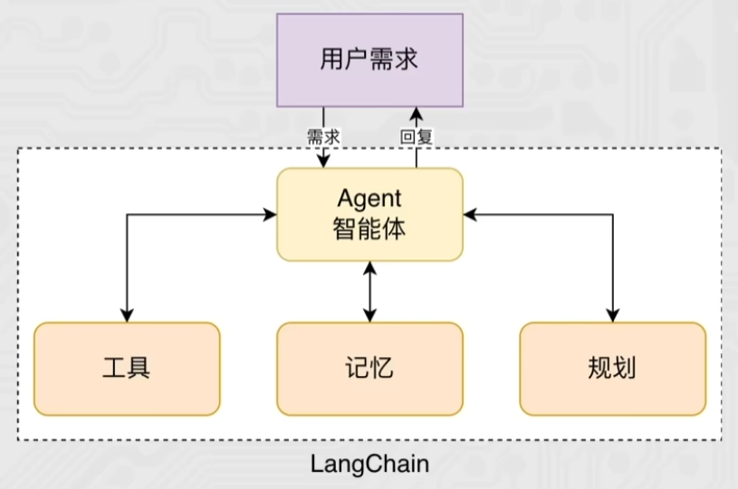

以电商商品问答为例：

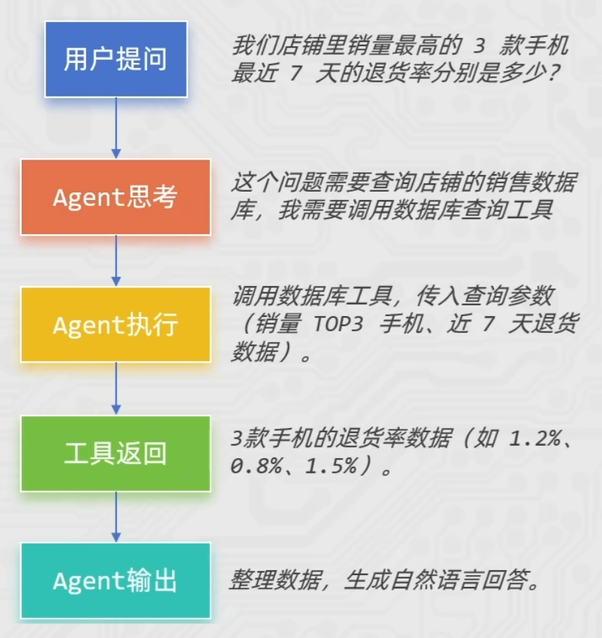

普通 Chain 与 Agent 对比：

|            普通 Chain            |                  Agent                   |
| :------------------------------: | :--------------------------------------: |
| 执行流程**固定**，按预设步骤运行 | 执行流程**动态**，根据任务和结果自主调整 |
|     工具调用路径写死在代码里     |         工具选择由 LLM 思考决定          |
|       适合简单、标准化任务       |     适合复杂、多步骤、需要决策的任务     |

Agent 智能体 = 大语言模型（大脑） + 工具集（手脚） +  决策逻辑（思维）， 是让 LLM 从 "只会回答" 升级为 "会做事（影响现实世界）" 的智能助手

### Agent 初体验

```python
from langchain.agents import create_agent
from langchain_community.chat_models.tongyi import ChatTongyi
from langchain_core.tools import tool

# 扩展大语言模型的能力边界
@tool(description="查询天气")
def get_weather() -> str:
    return "晴天"

agent = create_agent(
    model=ChatTongyi(model="qwen3-max"),           # 智能体的大脑 LLM
    tools=[get_weather],                           # 向智能体提供工具列表
    system_prompt="你是一个聊天助手，可以回答用户问题。",
)

res = agent.invoke(
    {
        "messages": [
            {"role": "user", "content": "明天深圳的天气如何？"},
        ]
    }
)

for msg in res["messages"]:
    print(type(msg).__name__, msg.content)
    
"""
HumanMessage 明天深圳的天气如何？
AIMessage 
ToolMessage 晴天
AIMessage 明天深圳的天气是晴天。建议外出时注意防晒，并保持水分补充！
"""

"""
parse = StrOutputPaeser()

for msg in res["messages"]:
    print(f"{type(msg).__name__}: {parser.invoke(msg)}")
"""
```

其中第一个 AIMessage 没有输出内容，是模型的思考，ToolMessage 是工具消息

### 流式输出

通过 create_agent 方法可以创建 Agent 对象，其也是 Runnable 接口的子类实现，所以也拥有：

- invoke 执行：一次型得到完整结果
- stream 执行：流式得到结果

```python
for chunk in agent.stream({
    "messages": [{"role": "user", "content": "Search for AI news and summarize the findings"}]
}, stream_mode="values"):
    # 每个块都包含该时刻的完整状态, 所以取最后一条, 即为最新
    latest_message = chunk["messages"][-1]
    if latest_message.content:
        print(f"Agent: {latest_message.content}")
    elif latest_message.tool_calls:
        print(f"Calling tools: {[tc['name'] for tc in latest_message.tool_calls]}")
```

#### 实战运用

```python
from langchain.agents import create_agent
from langchain_community.chat_models.tongyi import ChatTongyi
from langchain_core.tools import tool

@tool(description="获取股价，传入股票名称，返回字符串信息")
def get_price(name: str) -> str:
    return f"股票{name}的价格是20元"

@tool(description="获取股票信息，传入股票名称，返回字符串信息")
def get_info(name: str) -> str:
    return f"股票{name}，是一家A股上市公司，专注于IT职业教育。"

agent = create_agent(
    model=ChatTongyi(model="qwen3-max"),
    tools=[get_price, get_info],
    system_prompt="你是一个智能助手，可以回答股票相关问题，记住请告知我思考过程，让我知道你为什么调用某个工具"
)

for chunk in agent.stream(
    {"messages": [{"role": "user", "content": "传智教育股价多少，并介绍一下"}]},
    stream_mode="values"
):
    latest_message = chunk['messages'][-1]

    if latest_message.content:
        print(type(latest_message).__name__, latest_message.content)

    try:
        if latest_message.tool_calls:
            print(f"工具调用： { [tc['name'] for tc in latest_message.tool_calls]  }")
    except AttributeError as e:
        pass
```

### ReAct 行动框

Agent ReAct 是大模型智能体的核心思考与行动框架，全称 Reasoning + Acting（推理 + 行动），是让 Agent 像人类一样「思考问题→制定策略→执行行动→验证结果」的关键逻辑

简单来说：ReAct 让 Agent 不再是 “直接回答问题”，而是通过 “自然语言思考过程” 指导工具调用，一步步解决复杂问题，完美适配需要多步推理、工具协作的场景（如智能客服、报告生成、任务规划等）

一个典型的 ReAct 范式的 Agent 如图所示：

- 思考 Reasoning：分析问题，判断现有信息是否足够，明确下一步

  即模型决策是否需要调用外部工具获取更多信息用来回答

- 行动 Action：执行思考阶段指定的策略

  即基于模型决策结果，调用工具获取信息

- 观察 Observation：获取行动的结果，提取有效信息

  即获取工具返回值即判断工具是否正常工作位下一轮思考提供信息

- （再）思考 → （再）行动 → （再）观察 → 循环往复直到结束

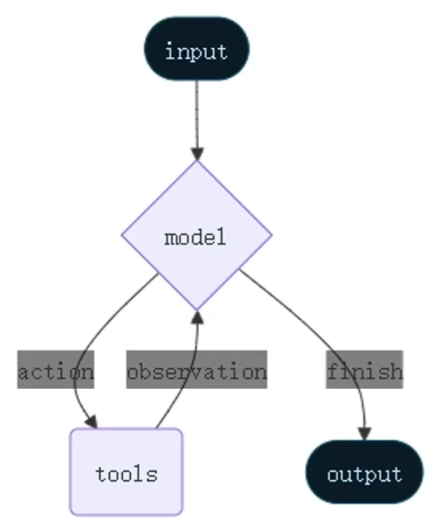

LangChain 的 Agent 对象遵循 ReAct 框架要求，在执行的过程中会持续的自我思考、自我行动、自我观察。 一个典型的 ReAct 案例如下：

```python
@tool(description="获取体重，返回值是整数，单位千克")
def get_weight() -> int:
    return 90

@tool(description="获取身高，返回值是整数，单位厘米")
def get_height() -> int:
    return 172

agent = create_agent(
    model=ChatTongyi(model="qwen3-max"),
    system_prompt="""你是严格遵循ReAct框架的智能体，必须按「思考→行动→观察→再思考」的流程解决问题，
且**每轮仅能思考并调用1个工具**，禁止单次调用多个工具。
并告知我你的思考过程，工具的调用原因，按思考、行动、观察三个结构告知我""",
    tools=[get_weight, get_height],
)

for chunk in agent.stream(
    {"messages": [{"role": "user", "content": "计算我的BMI"}]},
    stream_mode="values",
):
    latest_message = chunk["messages"][-1]
    if latest_message.content:
        print(latest_message.content.strip())
    try:
        if latest_message.tool_calls:
            print(f"Calling tools: {[tc['name'] for tc in latest_message.tool_calls]}")
    except AttributeError:
        pass
```

“**每轮仅能思考并调用1个工具，禁止单次调用多个工具**”只是为了方便展示，实际上 Langchain 是由并行调用工具的能力

### middleware 中间件

中间件的作用是对智能体的每一步工作进行控制和自定义的执行，其作用场景：

- 日志记录、分析、调试
- 转换提示词、工具选择
- 重试、备用、提前终止等逻辑控制
- 安全防护、个人身份检测等

无中间件：

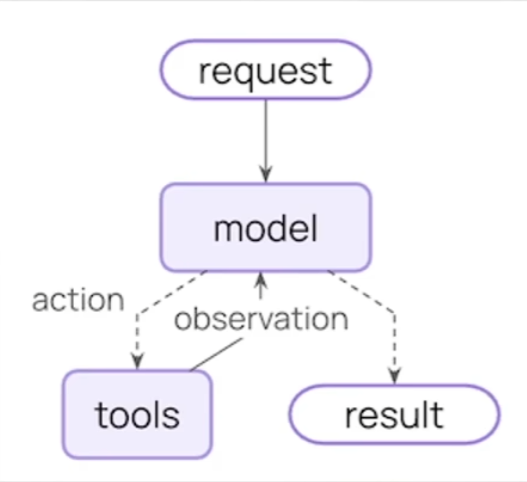

有中间件：

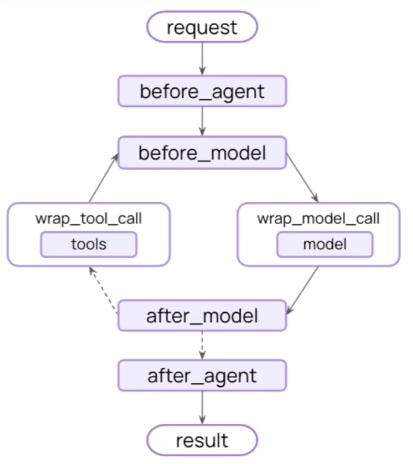

LangChain 中内置了一些基础的中间件，参见：

https://docs.langchain.com/oss/python/langchain/middleware/built‑in 

中间件通过 Hooks 钩子来实现拦截，自定义中间件可以简单的使用装饰器来定义

节点式钩子（执行点顺序拦截）：

- before_agent：agent 执行之前拦截
- after_agent：agent 执行后拦截
- before_model：模型执行前拦截
- after_model：模型执行后拦截

针对工具和模型的包装式钩子：

- wrap_model_call：每个模型调用时候拦截
- wrap_tool_call：每个工具调用时候拦截

```python
from langchain.agents import create_agent, AgentState
from langchain.agents.middleware import before_agent, after_agent, before_model, after_model, wrap_model_call, wrap_tool_call
from langchain_community.chat_models.tongyi import ChatTongyi
from langchain_core.tools import tool
from langgraph.runtime import Runtime

@tool(description="查询天气，传入城市名称字符串，返回字符串天气信息")
def get_weather(city: str) -> str:
    return f"{city}天气：晴天"

@before_agent
def log_before_agent(state: AgentState, runtime: Runtime) -> None:
    # agent执行前会调用这个函数并传入state和runtime两个对象
    print(f"[before agent]agent启动，并附带{len(state['messages'])}消息")

@after_agent
def log_after_agent(state: AgentState, runtime: Runtime) -> None:
    print(f"[after agent]agent结束，并附带{len(state['messages'])}消息")

@before_model
def log_before_model(state: AgentState, runtime: Runtime) -> None:
    print(f"[before_model]模型即将调用，并附带{len(state['messages'])}消息")

@after_model
def log_after_model(state: AgentState, runtime: Runtime) -> None:
    print(f"[after_model]模型调用结束，并附带{len(state['messages'])}消息")

@wrap_model_call
def model_call_hook(request, handler):
    print("模型调用啦")
    
    return handler(request)

@wrap_tool_call
def monitor_tool(request, handler):
    print(f"工具执行：{request.tool_call['name']}")
    print(f"工具执行传入参数：{request.tool_call['args']}")

    return handler(request)

agent = create_agent(
    model=ChatTongyi(model="qwen3-max"),
    tools=[get_weather],
    middleware=[log_before_agent, log_after_agent, log_before_model, log_after_model, model_call_hook, monitor_tool]
)

res = agent.invoke({"messages": [{"role": "user", "content": "深圳今天的天气如何呀，如何穿衣"}]})

"""
[before agent]agent启动，并附带1消息
[before_model]模型即将调用，并附带1消息
模型调用啦
[after_model]模型调用结束，并附带2消息
工具执行：get_weather
工具执行传入参数：{'city': '深圳'}
[before_model]模型即将调用，并附带3消息
模型调用啦
[after_model]模型调用结束，并附带4消息
[after agent]agent结束，并附带4消息
"""
```

## 手写笔记

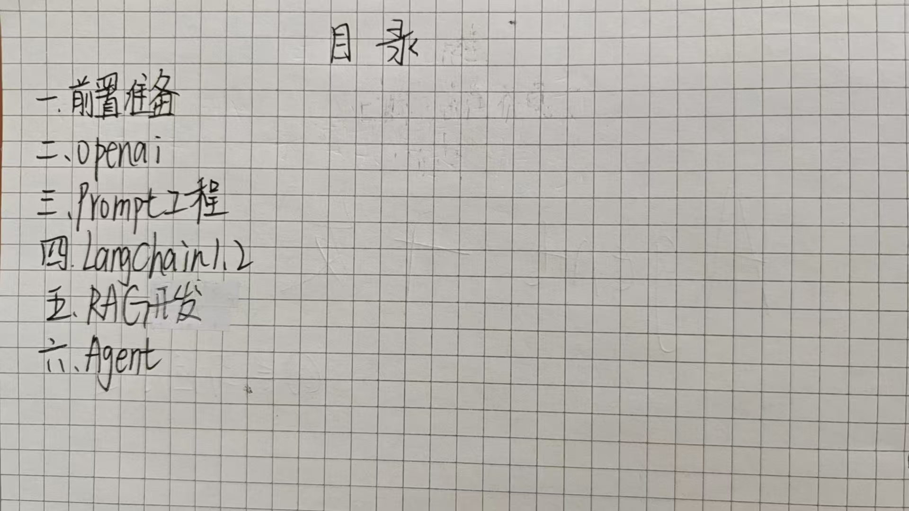

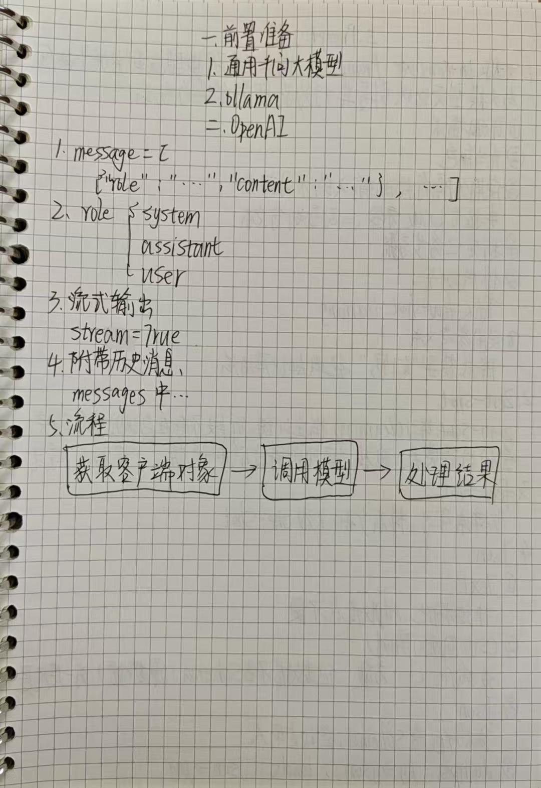

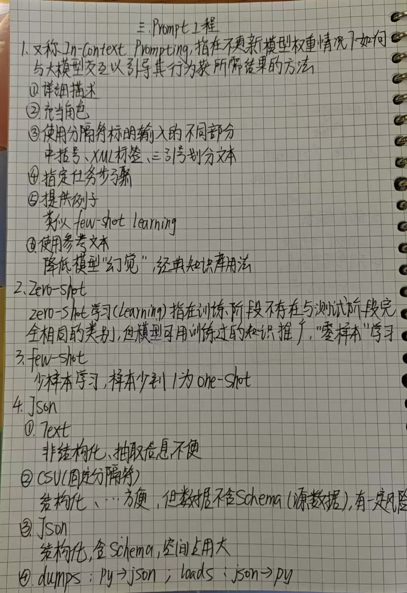

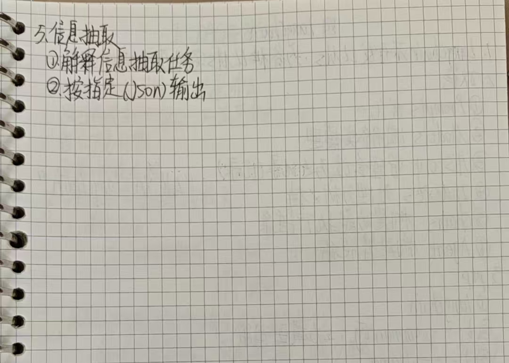

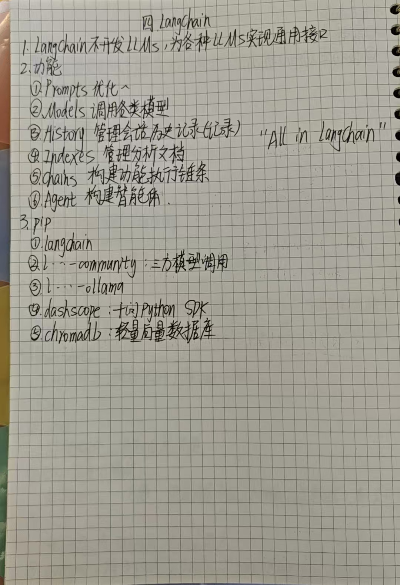

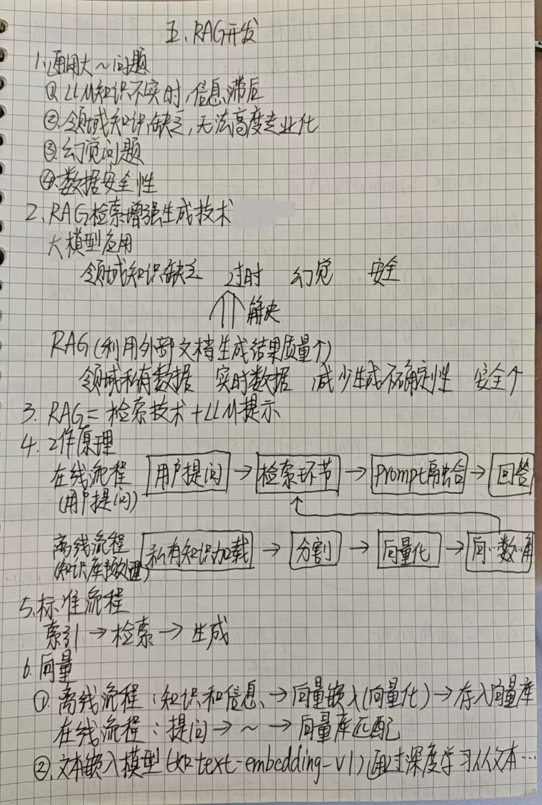

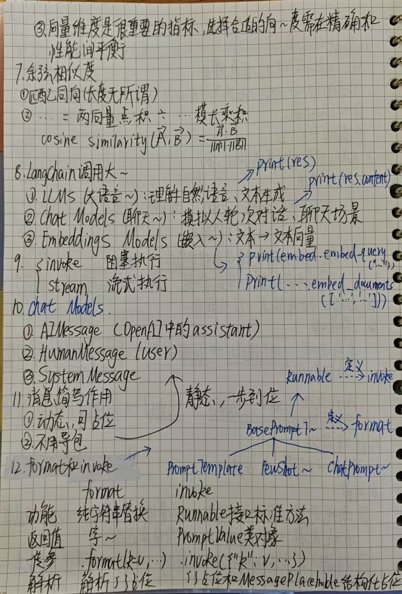

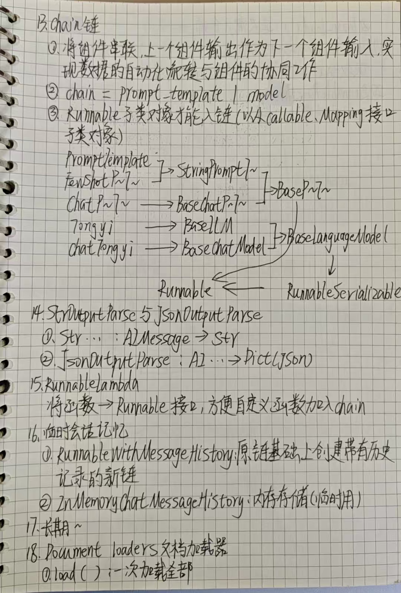

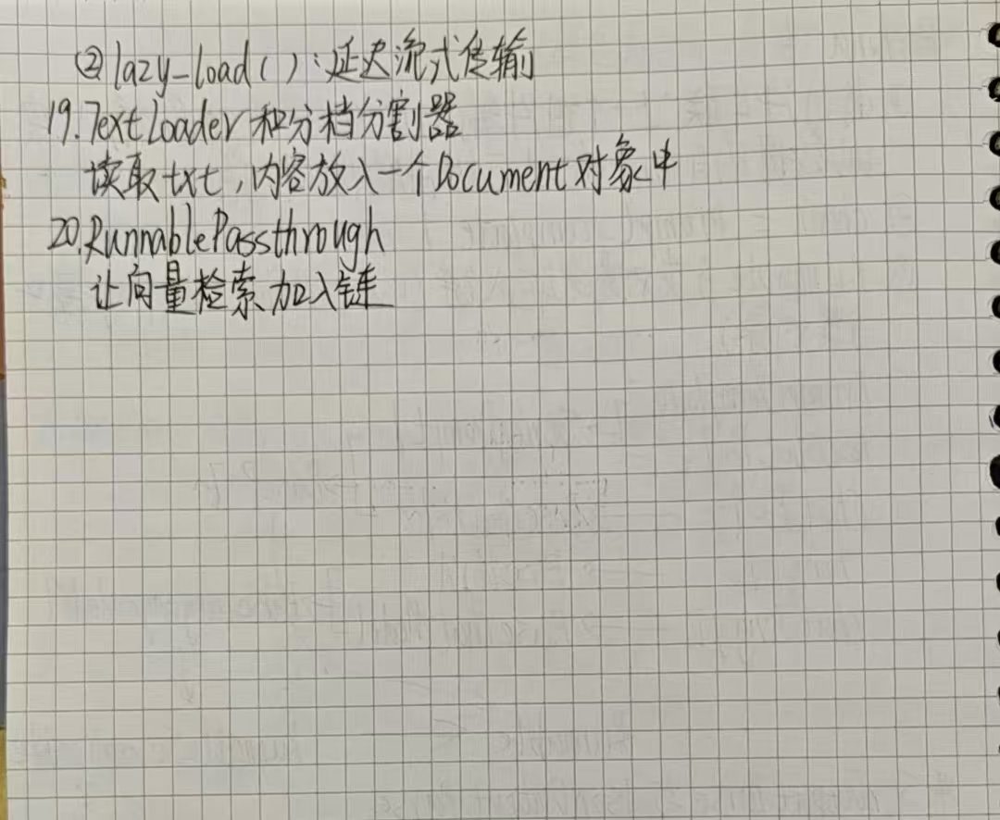

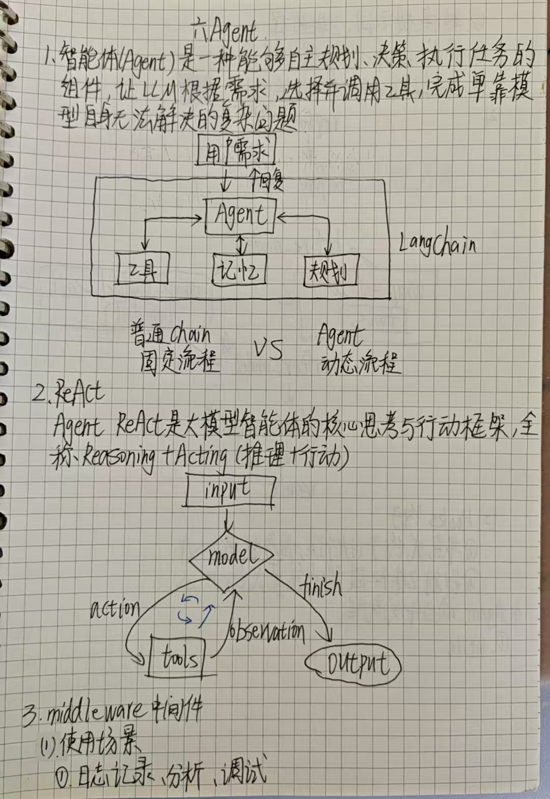

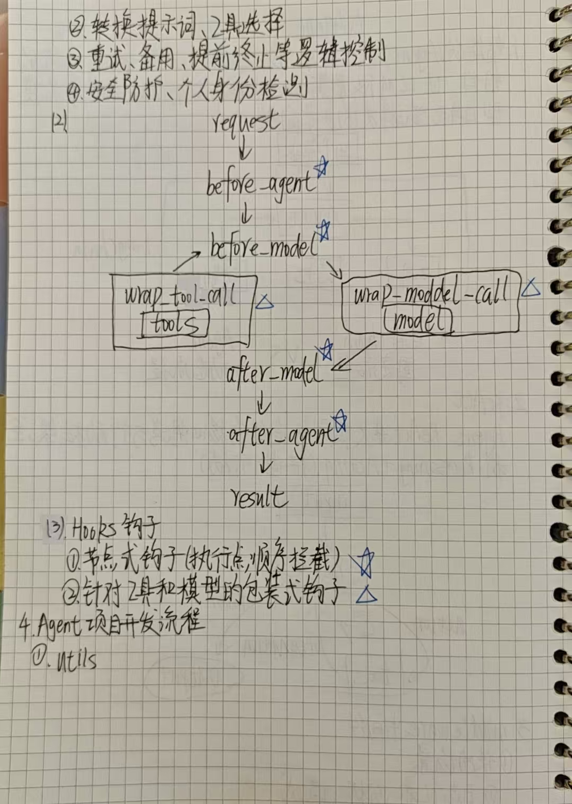